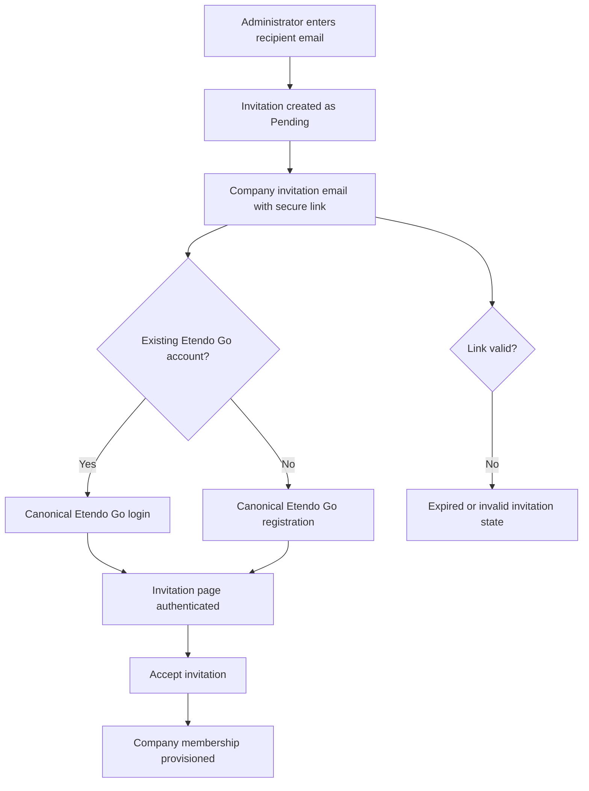
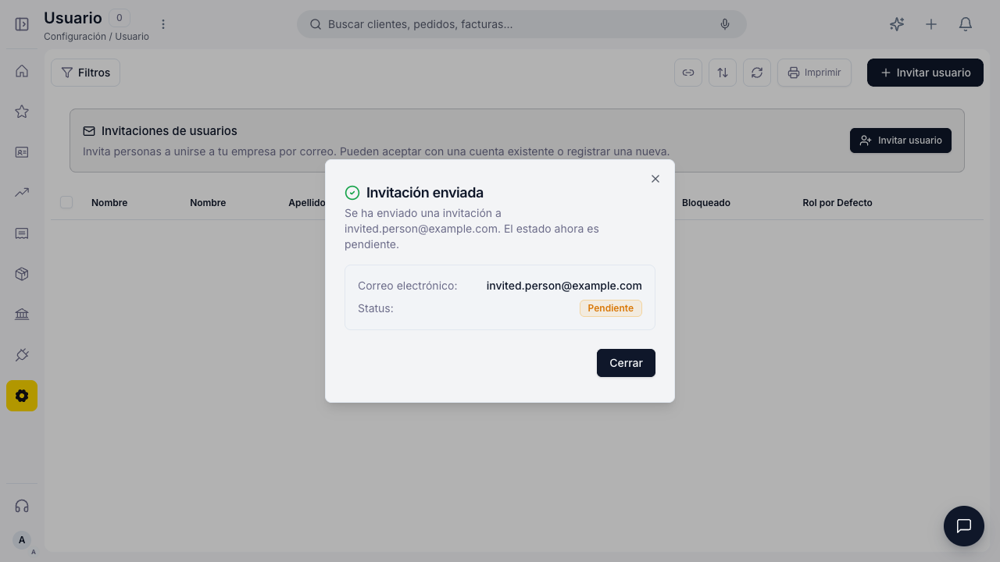
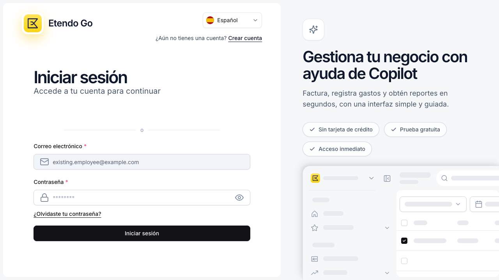
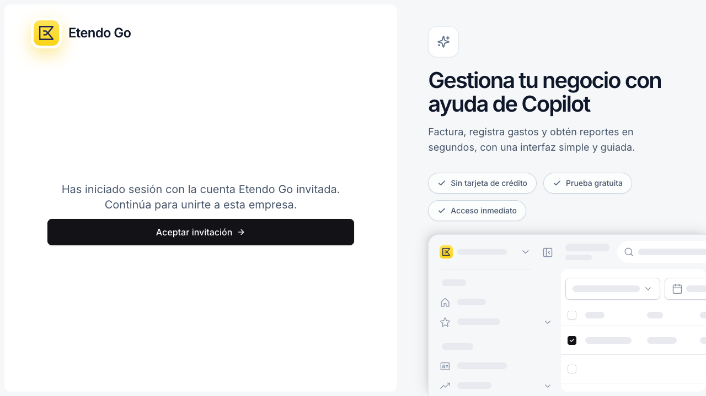
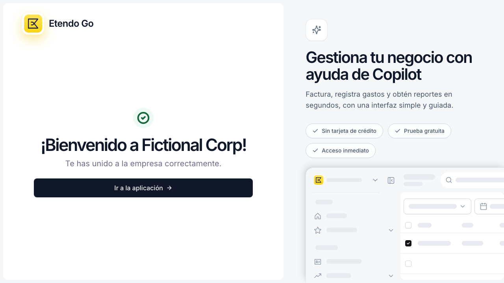
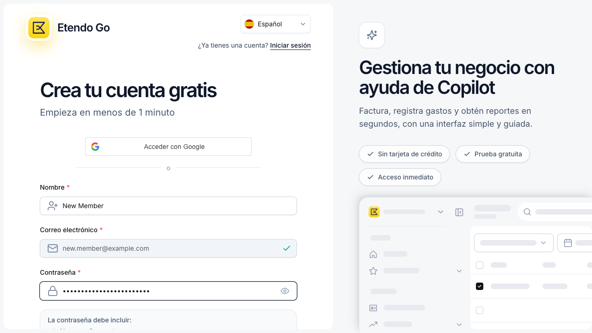
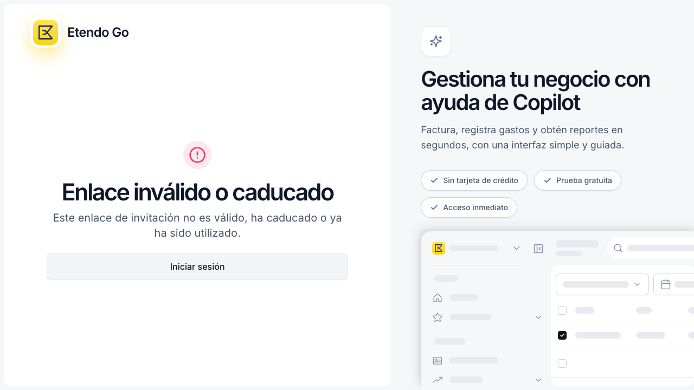
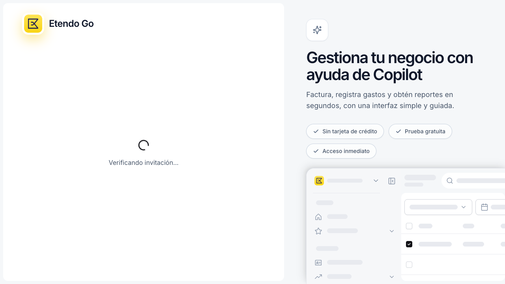
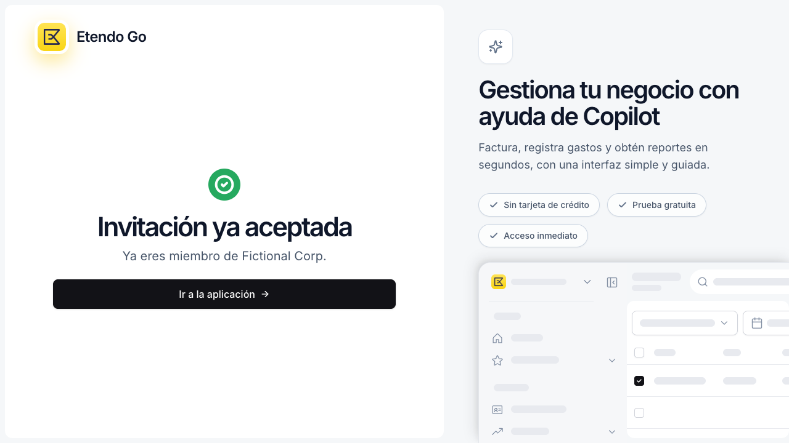
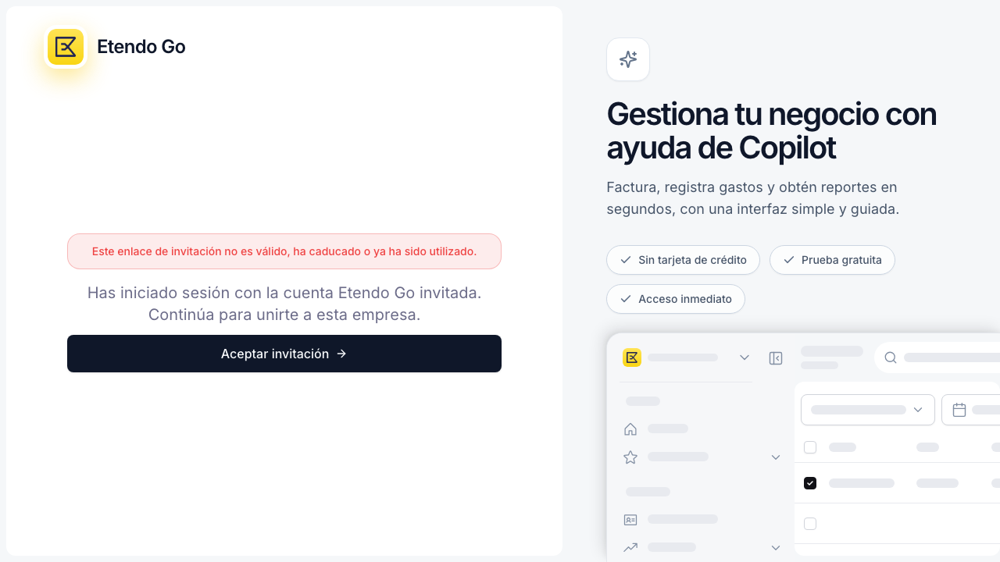

# ETP-4894 — Company User Invitations

## Contents

- [Functional summary](#functional-summary)
- [Complete flow](#complete-flow)
- [Acceptance matrix](#acceptance-matrix)
- [Visual evidence](#visual-evidence)
- [Tests and QA](#tests-and-qa)
- [Known limitations](#known-limitations)

## Functional summary

ETP-4894 implements company invitations as a dedicated flow, not as a password-reset flow.

An administrator enters only the recipient email. The invitation remains `Pending` until the recipient follows the email link and completes one of these paths:

1. An existing Etendo Go user signs in through the canonical Etendo Go login and then accepts the invitation.
2. A new recipient creates the minimum Etendo Go account from the invitation and accepts it without entering company onboarding.

## Complete flow

## Acceptance matrix

| Scenario | Expected result | Status | Evidence |
| --- | --- | --- | --- |
| Administrator invites by email only | Invitation is created as `Pending` | Passed | Pending invitation |
| Existing user opens the link | Canonical Etendo Go login is shown | Passed | Existing account login |
| Existing user authenticates | Invitation remains on `/invite` and offers acceptance | Passed | Authenticated invitation |
| Existing user accepts | Membership is accepted | Passed | Existing account success |
| New recipient opens the link | Canonical Etendo Go registration is shown | Passed | New account registration |
| New recipient registers and accepts | Account and membership are created without onboarding | Passed | New account success |
| Invalid or expired link | Safe error state is shown | Passed | Expired invitation |
| Invitation is already accepted | Idempotent confirmation is shown | Passed | Already accepted |
| Acceptance fails after authentication | Actionable error preserves the Etendo Go shell | Passed | Acceptance error |

## Visual evidence

- **Environment:** local App Shell mock (`VITE_MOCK=true`, `http://127.0.0.1:3100`)
- **Validation:** automated Playwright and Vitest
- **Playwright command:** `E2E_WORKERS=1 npx playwright test tests/flows/user-invitation.mocked.spec.js --project=mocked --workers=1 --reporter=list`
- **UI unit-test command:** `npx vitest run src/windows/custom/user/__tests__/index.vitest.jsx src/windows/custom/user/__tests__/InviteUserDialog.vitest.jsx src/pages/__tests__/InviteAcceptancePage.vitest.jsx`
- **Result:** Playwright passed — 7 tests in 22.7s; UI unit tests passed — 10 tests in 3 files.
- **Scope:** API responses are intercepted. These tests prove routing, request shape, login and registration gates, canonical Etendo Go surfaces, locked invitation email behavior, and visual checkpoints. They do not prove database persistence, authorization, email delivery, or tenant role assignment.

### 1. Administrator creates a pending invitation

Open evidence

The administrator enters only the recipient email. The dialog displays `Pending` and does not request a password, name, company setup, or onboarding data.

  

### 2. Existing Etendo Go account

Open evidence

The invitation link opens the existing-account branch and renders the canonical Etendo Go `LoginStep`. The email is read-only, and the recipient must authenticate before acceptance.

  

After the normal login, the recipient returns to `/invite` and sees the explicit **Accept invitation** action.

  

The successful result confirms that the company membership was accepted.

  

### 3. New recipient registers and accepts

Open evidence

The recipient sees the canonical Etendo Go registration surface. The invitation email remains locked to the trusted invitation record.

  

After registration, the recipient joins the company directly from `/invite`; the flow does not enter company onboarding.

  

### 4. Invalid or expired invitation

Open evidence

An invalid or expired link produces a safe user-facing error without exposing token details or backend internals.

  

### 5. Loading, already accepted, and acceptance error states

Open evidence

The invitation resolution loading state uses the Etendo Go shell.

  

An already accepted invitation shows an idempotent confirmation.

  

An acceptance failure after authentication preserves the Etendo Go shell and provides an actionable error.

  

## Tests and QA

- **Playwright:** 7 mocked invitation scenarios passed.
- **Vitest:** 10 focused UI tests passed across the User window, invitation dialog, and acceptance page.
- **Assertions:** routing, request shape, login/registration branch selection, locked email, authenticated acceptance, and error states.
- **Pending QA:** Matías Bernal / Emilio Polliotti.

## Known limitations

- The browser tests use intercepted API responses and do not prove database persistence, authorization, email delivery, or tenant role assignment.
- A deployed-backend browser acceptance test and a real email-provider delivery test are not included in this evidence package.
- Backend validation remains required for invitation authorization, tenant invitation-role policy, transaction/compensation behavior, lifecycle persistence, and transactional-email contract behavior.
