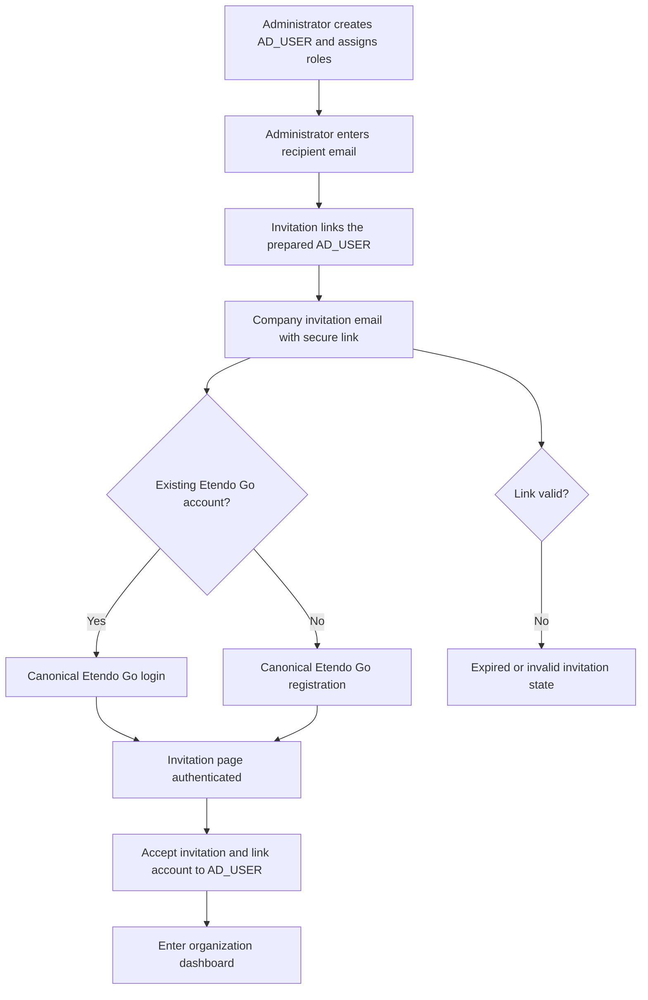
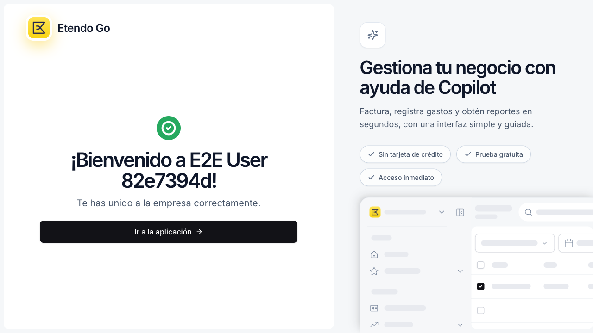
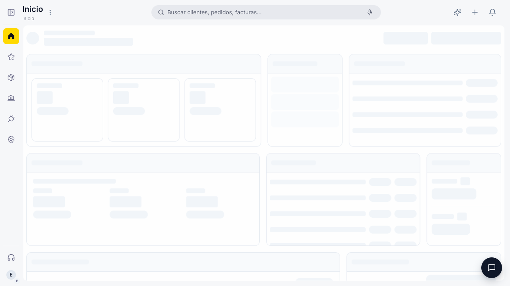

# ETP-4894 — Company User Invitations

## Contents

- [Functional summary](#functional-summary)
- [Complete flow](#complete-flow)
- [Acceptance matrix](#acceptance-matrix)
- [Visual evidence](#visual-evidence)
- [Real email integration E2E](#real-email-integration-e2e)
- [Tests and QA](#tests-and-qa)
- [Known limitations](#known-limitations)

## Functional summary

ETP-4894 implements company invitations as a dedicated flow, not as a password-reset flow.

An administrator first creates the target `AD_USER` and assigns its organization roles. The invitation screen then requires only the recipient email. The invitation remains `Pending` until the recipient follows the email link and completes one of these paths:

1. An existing Etendo Go user signs in through the canonical Etendo Go login and then accepts the invitation.
2. A new recipient creates the minimum Etendo Go account from the invitation and accepts it without entering company onboarding.

## Complete flow



## Acceptance matrix

| Scenario | Expected result | Status | Evidence |
| --- | --- | --- | --- |
| Administrator invites by email only | Invitation is created as `Pending` | Passed | Pending invitation |
| Existing user opens the link | Canonical Etendo Go login is shown | Passed | Existing account login |
| Existing user authenticates | Invitation remains on `/invite` and offers acceptance | Passed | Authenticated invitation |
| Existing user accepts | Membership is accepted | Passed | Existing account success |
| New recipient opens the link | Canonical Etendo Go registration is shown | Passed | New account registration |
| New recipient registers and accepts | Account and membership are created without onboarding | Passed | New account success |
| Invalid or expired link | Safe error state is shown | Passed | Expired invitation |
| Invitation is already accepted | Idempotent confirmation is shown | Passed | Already accepted |
| Acceptance fails after authentication | Actionable error preserves the Etendo Go shell | Passed | Acceptance error |
| Real backend sends invitation through email contract | Mailbox captures the link and browser accepts it | Passed | Email integration E2E |

## Visual evidence

- **Environment:** local App Shell mock (`VITE_MOCK=true`, `http://127.0.0.1:3100`)
- **Validation:** automated Playwright and Vitest
- **Playwright command:** `E2E_WORKERS=1 npx playwright test tests/flows/user-invitation.mocked.spec.js --project=mocked --workers=1 --reporter=list`
- **UI unit-test command:** `npx vitest run src/windows/custom/user/__tests__/index.vitest.jsx src/windows/custom/user/__tests__/InviteUserDialog.vitest.jsx src/pages/__tests__/InviteAcceptancePage.vitest.jsx`
- **Result:** Playwright passed — 7 tests in 22.7s; UI unit tests passed — 10 tests in 3 files.
- **Scope:** API responses are intercepted. These tests prove routing, request shape, login and registration gates, canonical Etendo Go surfaces, locked invitation email behavior, and visual checkpoints. They do not prove database persistence, authorization, email delivery, or tenant role assignment.

### 1. Administrator creates a pending invitation

<details>
<summary>Open evidence</summary>

The administrator enters only the recipient email. The dialog displays `Pending` and does not request a password, name, company setup, or onboarding data.

<p align="center">
  
</p>

</details>

## Real email integration E2E

This validation uses the real Etendo Go server and captures the final acceptance state. Its email delivery remains local: the provider payload is received by the mailbox mock, while the browser follows the exact link extracted from that payload.

The test uses the real Etendo Go server and the real `company-invitation` transactional email contract. Only the external provider is replaced by `e2e/support/email-sink.mjs`, which listens on host port `8025`; Tomcat reaches it through `host.docker.internal` and the existing Classic provider properties:

```properties
etendo.go.email.provider.baseUrl=http://host.docker.internal:8025/send
etendo.go.email.provider.apiKey=e2e-only-secret
etendo.go.email.provider.enabled=true
```

The test creates an email-only invitation from the User window, polls the mailbox by recipient, asserts the server-resolved `to`, `template`, and `data.link`, and navigates to the exact link captured from the email. It covers both branches:

1. Existing account: login through the canonical Etendo Go login and accept the invitation.
2. New account: register from the invitation and accept without entering company onboarding.

No raw token is logged or stored in the evidence documentation. No real provider is contacted.

### Execution

```bash
E2E_USE_MOCK=0 \
E2E_EMAIL_SINK=1 \
BASE_URL=http://127.0.0.1:3100 \
E2E_PASSWORD='<local-e2e-password>' \
../node_modules/.bin/playwright test \
  tests/flows/user-invitation.email.integration.spec.js \
  --project=integration --workers=1 --reporter=line
```

Required runtime: Etendo Go with the existing Classic email properties overridden to the local sink, the App Shell dev server at `BASE_URL`, and a disposable administrator credential. The validated run used local Tomcat, local Vite, the local mailbox sink, and one disposable existing account.

Result: **1 passed in 9.0s**. The test created a real invitation, received the server-generated email payload, extracted `/invite?token=...`, authenticated through the canonical Etendo Go login, accepted the invitation, and verified the success state. The token and credentials are not included in this document.

The final browser state is retained as visual evidence:

<p align="center">
  
</p>

The screenshot shows the Etendo Go-branded success state with the invited company name and the confirmation that the user joined the company successfully.

After clicking **Go to application**, the authenticated user reaches the Etendo Go environment selector, selects the invited organization, and enters its dashboard. This proves the invitation flow hands control back to the correct organization instead of leaving the user on the invitation page:

<p align="center">
  
</p>

### 2. Existing Etendo Go account

<details>
<summary>Open evidence</summary>

The invitation link opens the existing-account branch and renders the canonical Etendo Go `LoginStep`. The email is read-only, and the recipient must authenticate before acceptance.

<p align="center">
  
</p>

After the normal login, the recipient returns to `/invite` and sees the explicit **Accept invitation** action.

<p align="center">
  
</p>

The successful result confirms that the company membership was accepted.

<p align="center">
  
</p>

</details>

### 3. New recipient registers and accepts

<details>
<summary>Open evidence</summary>

The recipient sees the canonical Etendo Go registration surface. The invitation email remains locked to the trusted invitation record.

<p align="center">
  
</p>

After registration, the recipient joins the company directly from `/invite`; the flow does not enter company onboarding.

<p align="center">
  
</p>

</details>

### 4. Invalid or expired invitation

<details>
<summary>Open evidence</summary>

An invalid or expired link produces a safe user-facing error without exposing token details or backend internals.

<p align="center">
  
</p>

</details>

### 5. Loading, already accepted, and acceptance error states

<details>
<summary>Open evidence</summary>

The invitation resolution loading state uses the Etendo Go shell.

<p align="center">
  
</p>

An already accepted invitation shows an idempotent confirmation.

<p align="center">
  
</p>

An acceptance failure after authentication preserves the Etendo Go shell and provides an actionable error.

<p align="center">
  
</p>

</details>

## Tests and QA

- **Playwright:** 7 mocked invitation scenarios passed.
- **Real email integration E2E:** existing-account scenario passed against local Tomcat; the test captured the real invitation link from the local email sink and completed acceptance.
- **Vitest:** 10 focused UI tests passed across the User window, invitation dialog, and acceptance page.
- **Assertions:** routing, request shape, login/registration branch selection, locked email, authenticated acceptance, and error states.
- **Pending QA:** Matías Bernal / Emilio Polliotti.

## Known limitations

- The browser tests use intercepted API responses and do not prove database persistence, authorization, email delivery, or tenant role assignment.
- The external email provider is intentionally not contacted; delivery is verified through the local email sink. A production-provider delivery test remains out of scope.
- Backend validation remains required for invitation authorization, tenant invitation-role policy, transaction/compensation behavior, lifecycle persistence, and transactional-email contract behavior.
