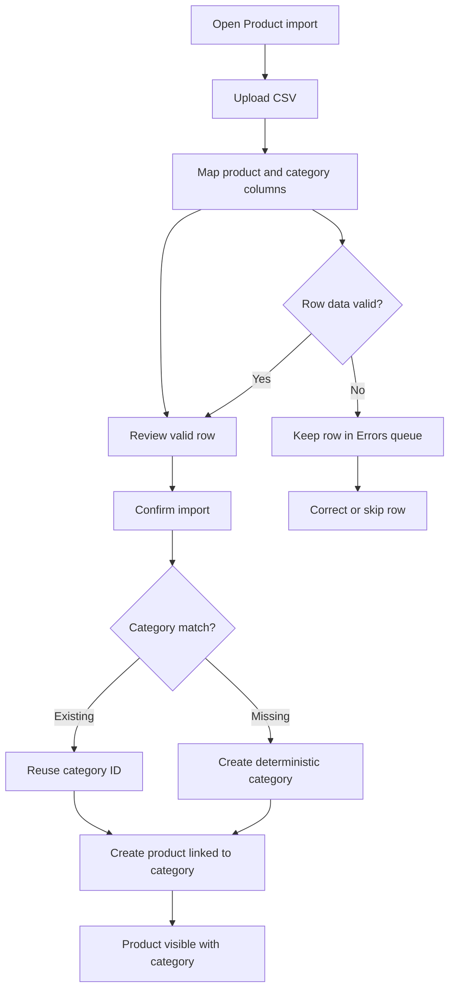
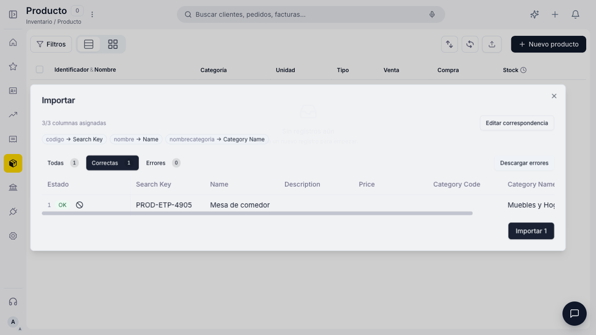
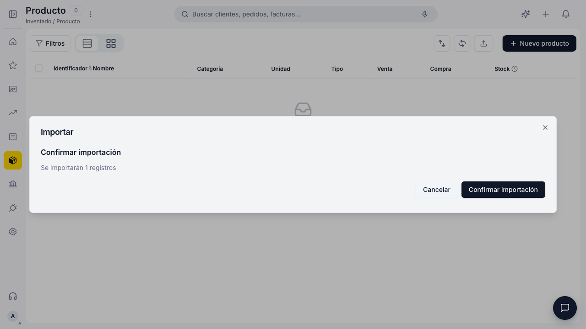
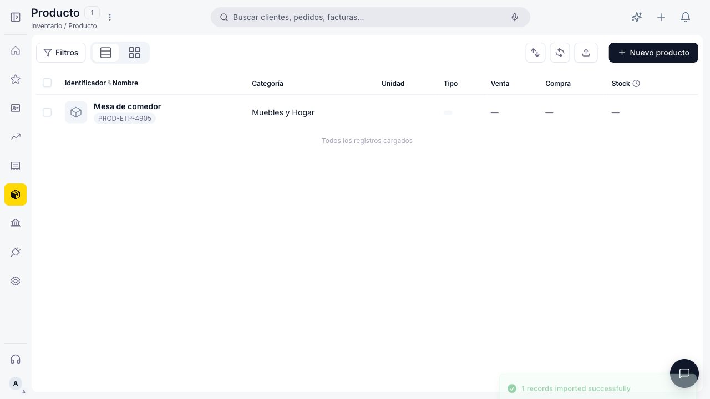
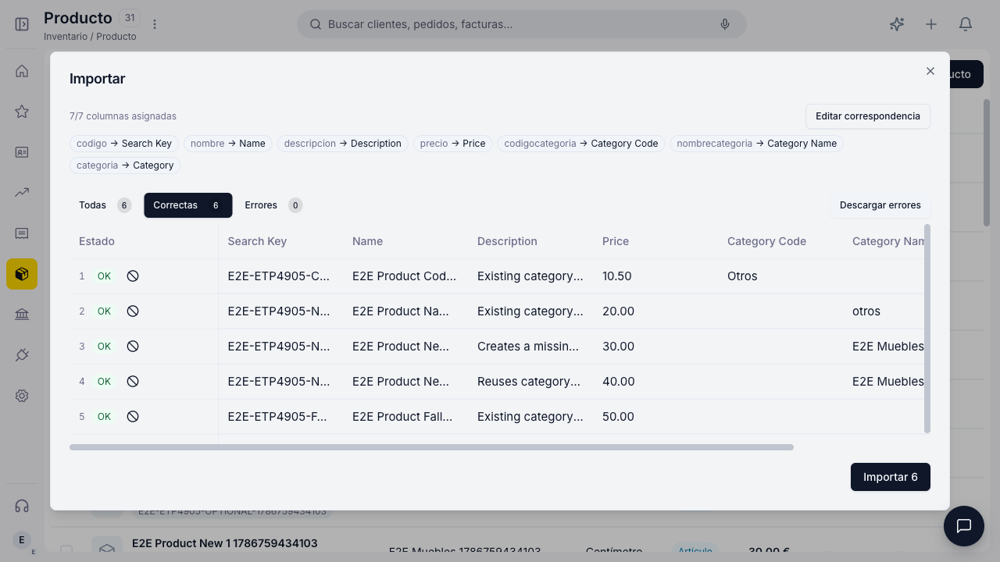
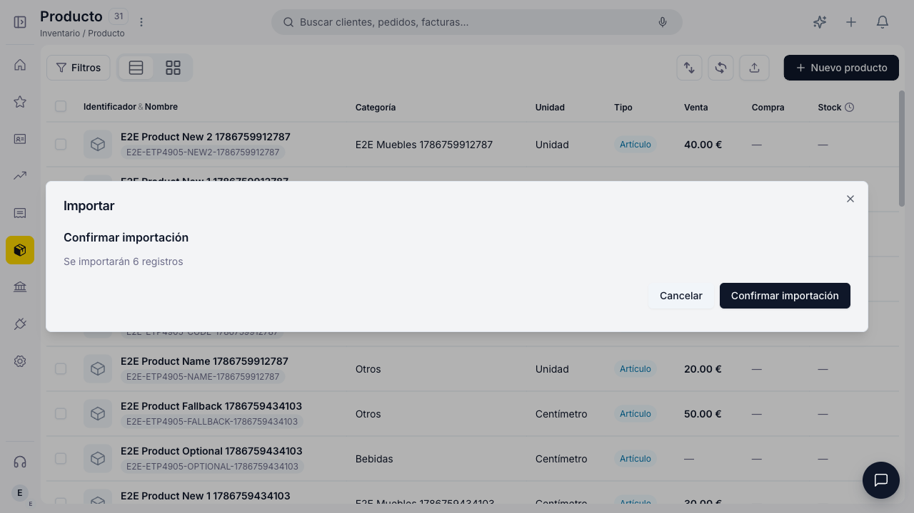
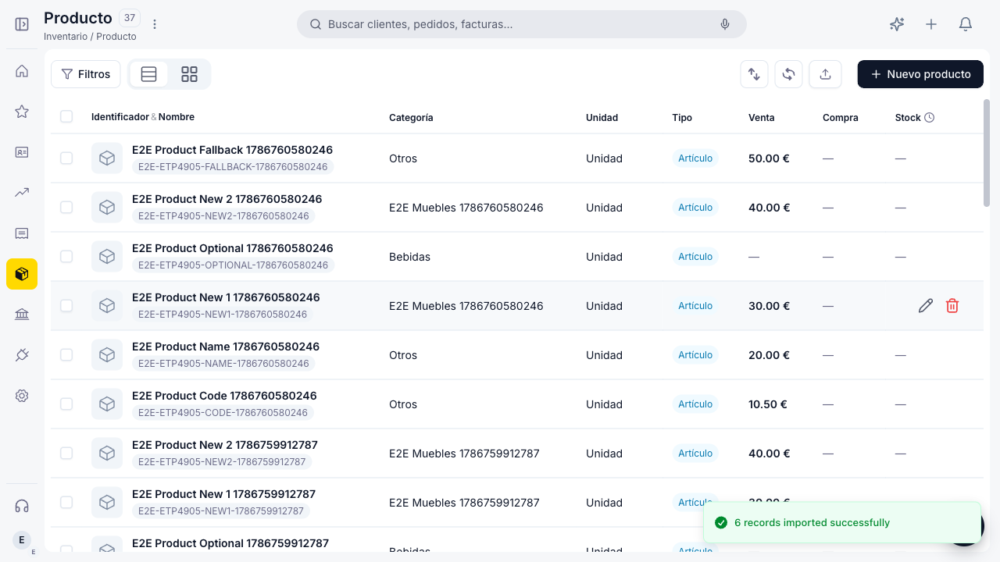
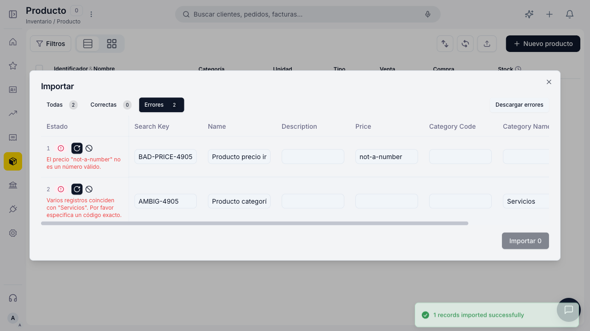
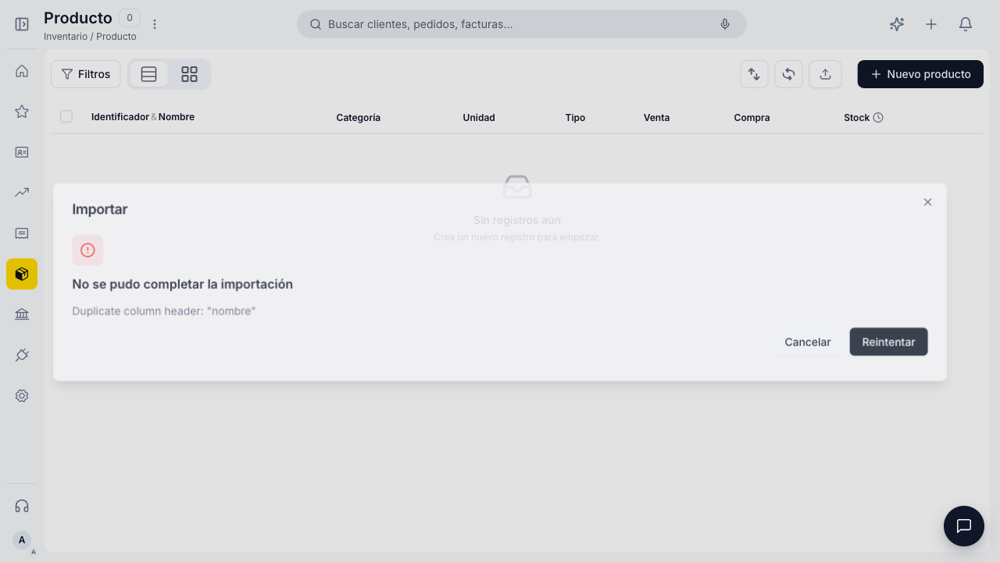

# ETP-4905 — Product import category resolution

## Overview

The Product import flow accepts category code, category name, or the legacy
category column. When a category is missing, the import creates it with a
deterministic search key and links the new product to the created category.
This delivery was validated with the real Product import UI against Tomcat:
five priced products, existing and new categories, and a row with optional
fields blank. Products without an explicit UOM receive the configured product
default (`Unidad`) through the same defaults endpoint used by the Product UI.
The local mocked-NEO flow remains as a deterministic UX smoke.
Invalid prices and ambiguous categories are isolated per row: they remain in
the error queue with actionable messages, are not sent to `/batch`, and valid
rows in the same file can still be imported.

## Contents

- [Overview](#overview)
- [User flow](#user-flow)
- [Acceptance matrix](#acceptance-matrix)
- [Visual evidence](#visual-evidence)
- [Automated validation](#automated-validation)
- [Scope and limitations](#scope-and-limitations)

## User flow



## Acceptance matrix

| Scenario | Expected result | Status | Evidence |
|---|---|---:|---|
| Upload a product CSV with category name | Import maps the category column and accepts the row | ✅ | [Review state](#scenario-1--csv-review) |
| Missing category | Category is created as `MUEBLES_Y_HOGAR` | ✅ | [HTTP evidence](./ETP-4905-product-import-http.json) |
| Product/category linkage | Product is committed with `productCategory=cat-e2e-4905` | ✅ | [Created state](#scenario-3--product-created-with-category) |
| Confirm before sending | User sees the row count and explicit confirmation action | ✅ | [Confirmation state](#scenario-2--confirmation) |
| Existing category by code or normalized name | Resolver reuses a unique match | ✅ | Product descriptor tests |
| Five products with price and all declared CSV columns | Each product creates a linked price operation | ✅ | [Tomcat multi-product evidence](#scenario-4--tomcat-multi-product-import) |
| Existing category and auto-created category in one file | Existing rows reuse the category; new rows share one created category | ✅ | [Tomcat multi-product evidence](#scenario-4--tomcat-multi-product-import) |
| Optional fields blank | Product imports without category/price; declared blank description is sent as empty text | ✅ | [Tomcat multi-product evidence](#scenario-4--tomcat-multi-product-import) |
| Default unit of measure | Products without an explicit UOM are persisted with the configured `Unidad` default | ✅ | [Tomcat multi-product evidence](#scenario-4--tomcat-multi-product-import) |
| Clean import review | Pre-send queue opens on `Correctas`; errors remain available in `Errores` | ✅ | Core regression test + Tomcat review screenshot |
| Ambiguous category | Import rejects the row instead of guessing | ✅ | Product descriptor ambiguity test |
| Invalid numeric price | Row is rejected with a localized validation message and is not sent | ✅ | [Error evidence](#scenario-5--invalid-and-ambiguous-rows) |
| Ambiguous category in a mixed file | Ambiguous row is rejected while the valid row is still imported | ✅ | [Error evidence](#scenario-5--invalid-and-ambiguous-rows) |
| Descriptor/build failure | Stays in the row error queue; the system-error dialog is reserved for backend failures | ✅ | Core regression test + [Error evidence](#scenario-5--invalid-and-ambiguous-rows) |
| Malformed CSV | Duplicate headers stop processing before mapping and expose Retry | ✅ | [Malformed file evidence](#scenario-6--malformed-file) |
| Concurrent rows with the same new category | One category creation is reused | ✅ | Product descriptor concurrency test |

## Visual evidence

The screenshots use the production Product import components and sanitized
fixtures; no credentials or tokens are included.

### Scenario 1 — CSV review

<details>
<summary>Expand CSV mapping and review evidence</summary>

The Product import dialog shows all three CSV columns mapped, including
`nombrecategoria → Category Name`, and one valid row ready to import.

<p align="center">
  
</p>

</details>

### Scenario 2 — Confirmation

<details>
<summary>Expand import confirmation evidence</summary>

The confirmation step reports one record to import and requires an explicit
confirmation before the batch is sent.

<p align="center">
  
</p>

</details>

### Scenario 3 — Product created with category

<details>
<summary>Expand completed import evidence</summary>

The Product grid shows `Mesa de comedor` with identifier `PROD-ETP-4905` and
the newly created category `Muebles y Hogar`. The success toast reports one
record imported successfully.

<p align="center">
  
</p>

</details>

### Scenario 4 — Tomcat multi-product import

<details>
<summary>Expand real backend happy-path and corner-case evidence</summary>

Environment: local Schema Forge dev server at `localhost:3100`, real Tomcat
backend through the Vite proxy, `E2E_USE_MOCK=0`. The CSV declares all seven
import columns and loads six rows: five products with categories and prices,
plus one product with optional category, price, and description values blank.

The review opens on `Correctas`, shows `7/7 columnas asignadas`, six valid
rows, and all category/price columns. Existing category resolution is shown by
`Otros`; missing rows use the same newly created `E2E Muebles ...` category.

<p align="center">
  
</p>

The confirmation step reports six records to send because every row has the
required product fields; the optional-field row remains valid without price or
category.

<p align="center">
  
</p>

The real backend returns six committed products. The grid shows the five
prices, existing and auto-created categories, `Unidad` as the default unit of
measure for every imported product, the optional row without a price, and the
success toast.

<p align="center">
  
</p>

</details>

### Scenario 5 — Invalid and ambiguous rows

<details>
<summary>Expand validation and partial-import evidence</summary>

The same CSV contains an invalid price, an ambiguous category (`Servicios`
matches two records), and one valid product. After sending, the two bad rows
remain in `Errores` with actionable Spanish messages; no batch operation is
sent for either bad row.

<p align="center">
  
</p>

The valid row is imported successfully in the same run, proving that one bad
row does not abort unrelated valid rows. Descriptor/build failures do not open
the system-error dialog; that surface remains reserved for backend failures
where a technical report is useful.

</details>

### Scenario 6 — Malformed file

<details>
<summary>Expand malformed CSV evidence</summary>

A CSV with duplicate headers is rejected before column mapping. The dialog
explains the format problem and exposes `Retry`, returning the user to the
dropzone without sending any request.

<p align="center">
  
</p>

</details>

## Automated validation

### Playwright E2E

```bash
LOCAL_CORE=1 E2E_USE_MOCK=1 npx playwright test \
  tests/flows/product-import-category-resolution.mocked.spec.js \
  --project=mocked --workers=1 --retries=0 --reporter=list
```

Result: **3 passed**. The tests assert category creation, successful batch
response, product/category linkage, visible grid rows, invalid-price and
ambiguous-category handling, partial import, malformed CSV rejection, and the
sanitized HTTP summary.

### Tomcat integration E2E

Test added for the real backend:

```bash
E2E_USE_MOCK=0 \
BASE_URL=http://localhost:3100 \
npx playwright test tests/flows/product-import-category-resolution.integration.spec.js \
  --project=integration --workers=1 --retries=0 --reporter=list
```

The test does not intercept `/sws/neo/*`: it uploads a unique CSV, observes the
real category POST and `/sws/neo/batch` responses, and verifies the resulting
product/category rows. The frontend remains on the same `localhost:3100` base
as the other integration specs; its Vite proxy forwards the API to the Tomcat
instance configured by `ETENDO_URL`.

Result: **1 passed**. It exercised five priced products, code/name/legacy
category resolution, deterministic category creation reuse, all declared
columns, and the optional-field path.

### Product descriptor

```bash
LOCAL_CORE=1 npm run test:vitest -- --run \
  src/windows/custom/product/__tests__/productImportDescriptor.vitest.js
```

Result: **14 tests passed**, including propagation of the configured UOM
default into batch product operations.

### Shared import core

```bash
LOCAL_CORE=1 node --test \
  packages/app-shell-core/src/lib/import/__tests__/resolveDependentEntity.test.js \
  packages/app-shell-core/src/lib/import/__tests__/importEngine.test.js
```

Result: **38 tests passed**.

### Import dialog core regression

```bash
LOCAL_CORE=1 npx vitest run \
  src/components/import/__tests__/ImportDialog.test.jsx
```

Result: **23 tests passed**, including the default `Correctas` tab, the
explicit `Errores` tab behavior for invalid rows, and the distinction between
row validation failures and backend/system failures.

## Scope and limitations

- The mocked Playwright test is labeled `local UX / mocked NEO`; the separate
  Tomcat integration test is the live persistence evidence.
- Negative-path screenshots use deterministic mocked NEO responses so invalid
  prices and duplicate category matches can be reproduced without polluting
  the Tomcat tenant; the Tomcat suite validates the real happy path and UOM
  persistence.
- The resolver's persistence-independent behavior and product descriptor
  orchestration are covered by the executable unit/core suites above.
- The live Tomcat test requires Tomcat on `localhost:8080`, a valid E2E login,
  and the current NEO contract export. It creates unique test data and should
  be run in a disposable/local tenant.
