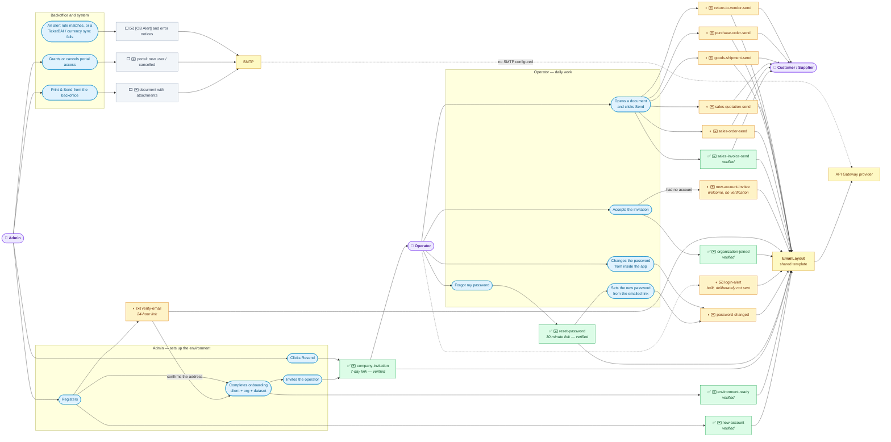

# Email Inventory: every email Etendo sends

> **Scope:** both delivery stacks — the Etendo GO transactional-email contracts
> (Etendo Go SaaS) and the classic Etendo Core SMTP path (backoffice + modules).
> **Task:** ETP-5003 — inventory the system emails and apply a unified template.
> This document is the inventory half; the unified template is the follow-up work.
> **Sources read:** `modules/com.etendoerp.go/src/com/etendoerp/go/schemaforge/email/**`,
> `modules/com.etendoerp.go/src/com/etendoerp/go/rest/**`, `src/org/openbravo/email/**`,
> `src/org/openbravo/portal/**`, `src/org/openbravo/erpCommon/**`, `src/com/etendoerp/email/spi/**`,
> `modules/com.smf.*`, `tools/app-shell/src/components/contract-ui/**`.

---

## 1. Map — who does what, who receives what, and what is verified

✉️ marks a node that is an actual email leaving the system; the rest are actions and infrastructure.

| | Meaning |
|---|---|
| ✅ green | Rendered through `EmailLayout` **and seen arriving in a real inbox** |
| ◐ amber | Migrated to `EmailLayout`, not yet observed in an inbox |
| ⬜ grey | Still builds its own body |



**6 verified, 15 migrated, 23 total.** The account greens were opened in a real inbox on 2026-08-25:
the invitation (including the resend path), the password reset stating its true 30-minute window,
and — from one run of a fresh admin through sign-up and onboarding — the welcome and the
environment-ready notice. A second run, an invited operator accepting from scratch, confirmed the
welcome again on that branch plus the organization-joined notice. Between the two runs, every
email an Admin or Operator can actually receive has now been seen arriving.

`password-changed` renders through the same layout and passes its tests but has
not been looked at; `login-alert` cannot be looked at at all, since no code path reaches it — and
by decision (2026-08-26) none will for now, so it stays amber indefinitely rather than pending work.

Note the invitee branch: accepting an invitation sends a welcome **only when the account is created
right there**, and the joined notice either way. Before ETP-5003 an invited operator received
neither — `sendNewAccount` was reachable only from the admin's own sign-up.

That welcome is a **separate contract**, `new-account-invitee`. The admin's own `new-account` now
carries the email-verification link, and an invited operator has nothing to verify: the invitation
is itself proof that somebody meant to reach the address, and the operator never runs onboarding —
the only flow the `403 EMAIL_NOT_VERIFIED` gate protects. Its button goes to the dashboard.

**F3 closed the company boundary.** The split used to fall exactly along it — everything Admin and
Operator received rendered through `EmailLayout`, everything the Customer or Supplier received did
not. Since 2026-08-26 the six document emails go through the same layout, so an invoice reaching a
customer now looks like the welcome reaching the admin. `sales-invoice-send` was opened in a real
inbox that day, PDF download link included; the other five share one implementation
(`DefaultDocumentSendEmailContract`) and differ only in their catalog entry, so the risk of an
unseen one looking different is low — but they have not been observed arriving.

Triggers, for the record: `handleRegister` sends the welcome, `handleOnboarding` sends
environment-ready once the client, organization and dataset exist, `handleChangePassword` sends the
security notice, `CompanyInvitationService` covers both invite and resend, and each document window
posts to `` `${windowName}-send` ``.

## 2. The two delivery stacks

| | Stack A — GO email contracts | Stack B — Core SMTP |
|---|---|---|
| Who uses it | Etendo Go (SaaS app + React shell) | Classic backoffice, portal, fiscal/utility modules |
| Entry point | `POST /sws/neo/email-contracts/{contract}/send` | `EmailManager.sendEmail(...)` → `EmailSenderDispatcher` |
| Who renders the HTML | **External API Gateway email service** (template id + JSON data) | Rendered in Java/FreeMarker, sent as a MIME message |
| Transport | HTTPS POST to the provider | SMTP (`javax.mail`) |
| Config | `etendo.go.email.provider.baseUrl` / `.apiKey` / `.enabled` / `.timeoutMs` (or `ETGO_EMAIL_PROVIDER_*` env) | AD SMTP config (client/org cascade, `SmtpCascadeResolver`) |
| Safety net | throttling, idempotency, kill switch, audit (`EmailSafetyStore`, `EmailDeliveryPolicy`) | none beyond the AD config |

**Bridge between the two:** `GoProviderEmailSender` implements the Core SPI
`com.etendoerp.email.spi.EmailSender`. When an environment has **no SMTP configured**, any Core-stack
email falls back to the GO provider (rendered with the provider's `custom` bring-your-own-content
template). It is a *fallback, not an override* — SMTP, when configured, still wins.

---

## 3. Master table — every email

### 3.A — Etendo GO: document emails ("send this invoice to the customer")

All of them share one implementation, `DefaultDocumentSendEmailContract`, and are triggered from the
React shell (`SendDocumentModal` → `documentEmailSend.js`). Contract name convention:
`` `${windowName}-send` `` (`resolveDocumentEmailContract`).

| # | Email | Contract name | Trigger | Provider template | Key files |
|---|---|---|---|---|---|
| 1 | Sales invoice to customer | `sales-invoice-send` | Send button / kebab in the Sales Invoice window | shared layout | `contracts/SalesInvoiceSendEmailContract.java`, `contracts/SalesDocumentEmailContractProvider.java`, `contracts/DalInvoiceEmailDocumentResolver.java` |
| 2 | Sales order to customer | `sales-order-send` | Sales Order window | shared layout | `contracts/SalesOrderSendEmailContract.java`, `contracts/DalOrderEmailDocumentResolver.java` |
| 3 | Sales quotation to customer | `sales-quotation-send` | Sales Quotation window | shared layout | `contracts/SalesQuotationSendEmailContract.java` |
| 4 | Goods shipment / delivery note | `goods-shipment-send` | Goods Shipment window | shared layout | `contracts/GoodsShipmentSendEmailContract.java`, `contracts/DalShipmentEmailDocumentResolver.java`, `contracts/ShipmentDocumentEmailContractProvider.java` |
| 5 | Purchase order to vendor | `purchase-order-send` | Purchase Order window | shared layout | `contracts/PurchaseOrderSendEmailContract.java`, `contracts/DalPurchaseOrderEmailDocumentResolver.java`, `contracts/PurchaseDocumentEmailContractProvider.java` |
| 6 | Return to vendor | `return-to-vendor-send` | Return to Vendor window | shared layout | `contracts/ReturnToVendorSendEmailContract.java` |

Since F3 (2026-08-26) all six render through `EmailLayout`, and their copy lives in
`email/render/messages/emails_{es_ES,en_US}.properties` (`document.subject`, `document.body`,
`document.cta`, plus one `{contract}.documentType` key each) rather than in Java literals.

> ⚠ **The default subject and body exist in two places.** When the operator sends without editing
> anything, the backend composes the copy from the catalog above — but the modal shows the operator
> what will go out by composing the *same* sentences itself (`SendDocumentModal.jsx` →
> `defaultSubject` / `defaultMessage`, plus `sendModalDefaultMessage` in the locale JSON). This is
> deliberate: it avoids a round trip on every modal open. The trade only holds while both sides
> agree, and they diverged once already, so `__tests__/defaultCopyInSync.vitest.js` reads the
> module's `.properties` and fails when they drift. Fix the mismatch, never the test.

Shared plumbing for 1–6:
`DefaultDocumentSendEmailContract.java`, `TransactionalEmailService.java`,
`NeoBuiltInEndpointHandler.java` (routes `email-contracts/{name}/send`),
`DocumentDownloadTokenService.java` (signed download link), `EmailMessageEdits.java` /
`EmailRecipientEdits.java` (operator overrides), `SalesDocumentEmailRecipientResolver.java`.
Frontend: `tools/app-shell/src/components/contract-ui/SendDocumentModal.jsx`,
`documentEmailSend.js`, `windows/custom/shared/useRowEmailModal.jsx`,
`windows/custom/shared/PreviewActionButtons.jsx`.

### 3.B — Etendo GO: account / auth emails

All of these render through `EmailLayout` since ETP-5003; the provider template column below records
what they used *before* that work, which is what the branded-template migration removed.

| # | Email | Contract name | Trigger (caller) | Provider template | Key files |
|---|---|---|---|---|---|
| 7 | New account / welcome | `new-account` | signup — `EtendoGoJwtServlet:619` → `sendNewAccount` | `custom` (subject+body built in Java, ES/EN) | `contracts/AccountLinkEmailContract.java`, `contracts/CoreEmailContractProvider.java` (`newAccountContent`), `rest/TransactionalAuthEmailSender.java` |
| 8 | Password reset link | `reset-password` | forgot-password — `EtendoGoJwtServlet:2336` → `sendPasswordReset` | `reset-password` (branded, provider-owned copy) | same as above + `rest/EtendoGoAuthLinkBuilder.java` |
| 9 | Password changed notice | `password-changed` | **both** password-change paths — `handleChangePassword` and `handlePasswordResetConfirm` | shared layout | `contracts/AccountNoticeEmailContract.java`, `CoreEmailContractProvider.java` |
| 10 | Environment ready | `environment-ready` | tenant provisioning finished — `EtendoGoJwtServlet:1461` | `custom` (`environmentReadyContent`), links to `/dashboard` | `contracts/AccountLinkEmailContract.java`, `rest/EtendoGoAccountProvisioning.java` |
| 11 | Company invitation | `company-invitation` | invite a user to a company — `CompanyInvitationService.java:200` | `custom` (subject/body in Java, ES/EN) | `contracts/CompanyInvitationEmailContract.java`, `rest/CompanyInvitationService.java`, `rest/CompanyInvitationDalHelper.java` |
| 12 | Email verification | `verify-email` | sign-up, and `POST /verify-email/resend` — `EtendoGoJwtServlet` | shared layout | `contracts/CoreEmailContractProvider.java`, `rest/EmailVerificationDalHelper.java` |
| 13 | Welcome for an invited user | `new-account-invitee` | invitation accepted when the account is created there — `CompanyInvitationService` | shared layout | `contracts/CoreEmailContractProvider.java`, `rest/TransactionalAuthEmailSender.java` |
| 14 | Organization joined | `organization-joined` | invitation accepted — `CompanyInvitationService` (both the existing-account and register-and-accept paths) | shared layout | `contracts/OrganizationJoinedEmailContract.java`, `rest/TransactionalAuthEmailSender.java` |
| 15 | Login alert (new IP/device) | `login-alert` | **deliberately not sent** (2026-08-26) — registered and reachable over the endpoint, no in-repo caller by decision | shared layout | `contracts/LoginAlertEmailContract.java` |

### 3.C — Etendo Core (classic SMTP)

| # | Email | Trigger | Template / format | Key files |
|---|---|---|---|---|
| 16 | Print & Send a document (invoice, order, …) from the backoffice | "Send by email" in the print flow | **AD template**: `TemplateInfo.EmailDefinition` (subject + body per document template/language) + PDF and record attachments | `src/org/openbravo/erpCommon/utility/reporting/printing/EmailUtilities.java`, `PrintController.java`, `TabAttachments.java` |
| 17 | New portal user (credentials / access granted) | `GrantPortalAccessProcess` → `EmailEventManager` | **FreeMarker**: `src/org/openbravo/portal/templates/email-new-user.ftl`; subject from AD_Message via `OBMessageUtils` | `src/org/openbravo/portal/NewUserEmailGenerator.java`, `PortalEmailBody.java` |
| 18 | Portal account cancelled | `AccountChangeObserver` → `EmailEventManager` | **FreeMarker**: `email-account-cancelled.ftl`; subject `Portal_AccountCancelledSubject` | `src/org/openbravo/portal/AccountCancelledEmailGenerator.java` |
| 19 | Alert rule notification (`[OB Alert] …`) | `AlertProcess` background job | **plain text hardcoded in Java**, header from AD_Message `AlertMailHead` | `src/org/openbravo/erpCommon/ad_process/AlertProcess.java:451-470` |

Shared plumbing for 13–16: `src/org/openbravo/email/EmailEventManager.java`,
`EmailEventContentGenerator.java`, `SmtpCascadeResolver.java`,
`src/org/openbravo/erpCommon/utility/poc/EmailManager.java` / `EmailInfo.java`,
`src/com/etendoerp/email/spi/{EmailSender,EmailSendContext,DefaultSmtpEmailSender}.java`,
`src/org/openbravo/email/actionhandler/TestSmtpConnectionActionHandler.java` (test-connection button).

### 3.D — Module-specific emails

| # | Email | Trigger | Template / format | Key files |
|---|---|---|---|---|
| 20 | TicketBAI submission error | TicketBAI send failure | HTML string built in Java, texts from AD_Message | `modules/com.smf.ticketbai/src/com/smf/ticketbai/email/ErrorEmailSender.java`, `TbaiEmailSender.java` |
| 21 | Currency conversion-rate sync failure | scheduled rate sync fails | HTML from two AD_Message keys (`String.format`) | `modules/com.smf.currency.conversionrate/src/com/smf/currency/conversionrate/SyncFailureEmailSender.java` |
| 22 | SII multi-report result | `ProcesoInformeMultiple` | plain Java-built message | `modules/org.openbravo.module.sii/src/org/openbravo/module/sii/reports/ProcesoInformeMultiple.java` |
| 23 | Scheduled/AD report delivery | report scheduled with email delivery | AD report definition + attachment | `modules_core/org.openbravo.client.application/src/org/openbravo/client/application/report/BaseReportActionHandler.java` |

**Not an Etendo email:** Stripe Checkout receipts. `HostedCheckoutService` only passes
`customer_email` to Stripe; the receipt is sent by Stripe, not by us.

---

## 4. Where does the format live? (the question behind the question)

> **This section changed with ETP-5003.** Before it, the answer was "in three different places, none
> of them a template file". The two rows that used to describe the GO emails are gone: no GO email
> is rendered by a provider template any more, and none builds its markup from Java literals.

| Format source | Which emails | What it means for changing the copy |
|---|---|---|
| **`EmailLayout` + message catalog** (this repo) | #1–#14 — every Etendo GO email | The markup lives in exactly one Java class, `email/render/EmailLayout.java`; the words live in `email/render/messages/emails_{es_ES,en_US}.properties`. Changing wording = editing a `.properties` line. Changing the *look* = editing `EmailLayout`, once, for all fourteen. Adding a locale = adding a `.properties` file. |
| **FreeMarker `.ftl` in the repo** | #14, #15 | `src/org/openbravo/portal/templates/*.ftl` — the only real, editable email template files in the codebase. |
| **AD data (Application Dictionary)** | #13 (`EmailDefinition` per document template + language), and subject strings of #14–#18 (AD_Message) | Editable by config/translation, no code change needed. |
| **Plain string in Java** | #16, #17, #18, #19 | Hardcoded; needs a code change (or an AD_Message edit where it uses `OBMessageUtils`). |

**Only `EmailLayout` emits markup.** That is the rule the migration bought, and it is worth stating
plainly: a contract that builds its own `<table>` or inlines its own CSS has reintroduced the problem
this task existed to remove. Contracts supply an `EmailContent` (greeting, paragraphs, CTA, note,
signature); the layout decides how it looks.

### Gaps still open

- **`login-alert` (#6 in the map) has no producer — on purpose.** The contract is registered and its
  catalog entries exist in both locales, but nothing in either repo calls it, and as of 2026-08-26
  **that is a decision, not an oversight: we are not sending this email yet.** It stays built and
  dormant so the work survives until the call is revisited. Do not wire it to the sign-in path
  looking to close a gap.
- **Only two locales.** `emails_es_ES` and `emails_en_US`. Anything else resolves to Spanish through
  the explicit fallback — deliberately, since `ResourceBundle` would otherwise let the *server's*
  JVM locale pick the language of a customer's email (this is why `EmailMessages` uses
  `getNoFallbackControl`).
- **Stack B is untouched.** #15–#23 — the Core SMTP emails, `.ftl` templates, AD_Message subjects —
  still look nothing like the GO ones. F5 covers the two portal emails; the rest is out of scope.

### Fixed since the first version of this document

- The **document-type label divergence** — the modal derived it from the UI locale while
  `documentTypeLabel()` returned a fixed Spanish string, so the subject differed between what the
  operator previewed and what the customer received under `en_US`. It now reads the catalog by
  language, falling back to the contract's constructor value rather than emitting a raw key.
- **Copy duplicated ES/EN inside Java** (`CoreEmailContractProvider`,
  `CompanyInvitationEmailContract`) — replaced by the `.properties` catalogs.
- **Validity windows stated as literals.** Three separate emails announced a duration that did not
  match the token behind them (a 7-day invitation saying "24 horas", then "6 días" from a truncating
  `ChronoUnit.DAYS.between`, and a 30-minute reset link the UI called 15 minutes). Any stated window
  is now interpolated from the record through `ValidityWindow`, which rounds up.

---

## 5. Is there a delivery history in the database?

Yes for Stack A, but it is an **anti-abuse ledger, not a readable history** — the distinction
matters the moment someone asks for "show me what we sent this customer".

Everything lives in one table, `ETGO_Email_Safety`, discriminated by `RECORD_TYPE`
(`AUDIT`, `THROTTLE`, `KILL_SWITCH`). `DalEmailSafetyStore.recordAudit` writes one `AUDIT` row per
send attempt; `TransactionalEmailService` uses `InMemoryEmailSafetyStore` only in tests.

**What a row gives you:** `RECORD_TYPE`, `CONTRACT_NAME`, `STATUS` (`SENT` / `DUPLICATE` / a failure),
`AUDIT_TIME`, `IDEMPOTENCY_KEY`, `TENANT_ID`, and a JSON `PAYLOAD` carrying `recordId`,
`recipientHash`, `recipientDomain`, `httpStatus`, `providerStatus` and `duplicate`.

**What it does not give you, and this is the part that surprises people:**

- **The recipient is not readable.** `payload.recipientHash` is SHA-256 of the lowercased address.
  You can *verify* that a known address was written to (hash it and compare) but you cannot list who
  was mailed. Only `recipientDomain` is in clear.
- **Neither the subject nor the body is stored,** and neither is the attached PDF or its link.
- **`payload.userId` is null in practice** — verified against a local instance, 24 of 24 audit rows.
  The sender is recoverable only from Etendo's own `CREATEDBY` audit column, which does hold the
  right user. A report reading the JSON for "who sent it" will silently come back empty.
- **Rows are written with `AD_CLIENT_ID = '0'`** (System), because the write happens under admin mode
  against a client-0 record. The tenant is in the separate `TENANT_ID` varchar column, so **a
  per-client report must filter on `TENANT_ID`, not `AD_CLIENT_ID`.**
- **There is no AD window over the table** — confirmed by query: it has no `AD_Tab`. Today the only
  way in is SQL.

Stack B leaves no trace here at all: the Core SMTP path never reaches `TransactionalEmailService`.

Consequence for anyone asked to build "sent history" on a document: the `recordId` → `AUDIT_TIME`
link already exists and is enough for *whether and when*. Showing **to whom** and **what was said**
needs new columns — the audit deliberately hashes the address, so this is a privacy decision to make
explicitly, not an oversight to patch.

---

## 6. Rate limits — and why they block development

The same `ETGO_Email_Safety` table enforces throttling, and the document-send ceilings are tight
enough that ordinary development trips them. The one that bites first:

| Scope | Default | What it means |
|---|---|---|
| **per record** | **3 / hour** | sends of the **same** document |
| per recipient | 20 / hour | sends to the same address |
| per user | 50 / hour | sends by the same operator |
| per tenant | 100 / hour | sends by the whole client |
| per domain | 200 / hour | sends to one recipient domain |
| global | 2000 / minute | burst guard, not configurable |

Testing a template change against one invoice means the fourth send is refused for the rest of the
hour, with a `THROTTLE` row rather than an error that explains itself. Sending every test to your own
address adds the per-recipient ceiling on top.

Each ceiling can be raised per environment (ETP-5003), in the Etendo root `gradle.properties`:

```properties
etendo.go.email.throttle.maxPerRecord=500
etendo.go.email.throttle.maxPerRecipient=500
```

Full property/env-var table, plus the two non-obvious behaviours — raising a ceiling resets the
counter, and a malformed override is ignored rather than honoured — are in
`modules/com.etendoerp.go/docs/transactional-email-contracts.md` § *Per-environment throttle
ceilings*. **The defaults are the production values**, so an environment that sets nothing is
unaffected.

Note these live outside both repos, in the Etendo root, so they do not travel with a clone: a new
machine needs them set again.

---

## 7. Related existing docs

- `docs/plans/2026-08-26-reply-to-email-gateway-lambda.md` — Reply-To (and CC) mapping in the
  gateway Lambda, which lives in a third repo: `etendosoftware/etendo-go-infraestructure`

- `modules/com.etendoerp.go/docs/transactional-email-contracts.md`
- `modules/com.etendoerp.go/docs/document-email-contract-implementation.md`
- `docs/email-contracts.md`, `docs/transactional-email-framework.md`
- `modules/com.etendoerp.go/docs/plans/2026-08-10-go-provider-email-sender-design.md`
