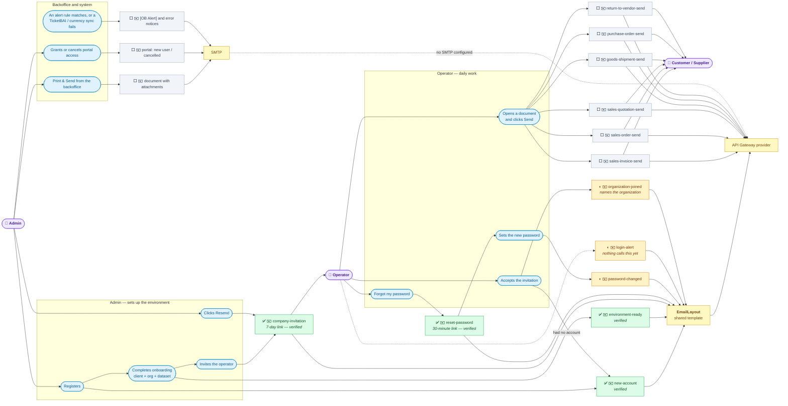

# Email Inventory: every email Etendo sends

> **Scope:** both delivery stacks — the Etendo GO transactional-email contracts
> (Etendo Go SaaS) and the classic Etendo Core SMTP path (backoffice + modules).
> **Task:** ETP-5003 — inventory the system emails and apply a unified template.
> This document is the inventory half; the unified template is the follow-up work.
> **Sources read:** `modules/com.etendoerp.go/src/com/etendoerp/go/schemaforge/email/**`,
> `modules/com.etendoerp.go/src/com/etendoerp/go/rest/**`, `src/org/openbravo/email/**`,
> `src/org/openbravo/portal/**`, `src/org/openbravo/erpCommon/**`, `src/com/etendoerp/email/spi/**`,
> `modules/com.smf.*`, `tools/app-shell/src/components/contract-ui/**`.

---

## 1. Map — who does what, who receives what, and what is verified

✉️ marks a node that is an actual email leaving the system; the rest are actions and infrastructure.

| | Meaning |
|---|---|
| ✅ green | Rendered through `EmailLayout` **and seen arriving in a real inbox** |
| ◐ amber | Migrated to `EmailLayout`, not yet observed in an inbox |
| ⬜ grey | Still builds its own body |

**4 verified, 7 migrated, 21 total.** All four greens were opened in a real inbox on 2026-08-25:
the invitation (including the resend path), the password reset stating its true 30-minute window,
and — from one run of a fresh admin through sign-up and onboarding — the welcome and the
environment-ready notice. That single run covers the whole Admin column of this graph.

Three ambers remain. `password-changed` and the new `organization-joined` render through the same
layout and pass their tests but have not been looked at; `login-alert` cannot be looked at at all,
since no code path reaches it.

Note the invitee branch: accepting an invitation sends the welcome **only when the account is
created right there**, and the joined notice either way. Before ETP-5003 an invited operator
received neither — `sendNewAccount` was reachable only from the admin's own sign-up.

The split still falls along the company boundary: everything **Admin and Operator** receive is
migrated, everything the **Customer or Supplier** receives is not. F3 fixes that.

Triggers, for the record: `handleRegister` sends the welcome, `handleOnboarding` sends
environment-ready once the client, organization and dataset exist, `handleChangePassword` sends the
security notice, `CompanyInvitationService` covers both invite and resend, and each document window
posts to `` `${windowName}-send` ``.

## 2. The two delivery stacks

| | Stack A — GO email contracts | Stack B — Core SMTP |
|---|---|---|
| Who uses it | Etendo Go (SaaS app + React shell) | Classic backoffice, portal, fiscal/utility modules |
| Entry point | `POST /sws/neo/email-contracts/{contract}/send` | `EmailManager.sendEmail(...)` → `EmailSenderDispatcher` |
| Who renders the HTML | **External API Gateway email service** (template id + JSON data) | Rendered in Java/FreeMarker, sent as a MIME message |
| Transport | HTTPS POST to the provider | SMTP (`javax.mail`) |
| Config | `etendo.go.email.provider.baseUrl` / `.apiKey` / `.enabled` / `.timeoutMs` (or `ETGO_EMAIL_PROVIDER_*` env) | AD SMTP config (client/org cascade, `SmtpCascadeResolver`) |
| Safety net | throttling, idempotency, kill switch, audit (`EmailSafetyStore`, `EmailDeliveryPolicy`) | none beyond the AD config |

**Bridge between the two:** `GoProviderEmailSender` implements the Core SPI
`com.etendoerp.email.spi.EmailSender`. When an environment has **no SMTP configured**, any Core-stack
email falls back to the GO provider (rendered with the provider's `custom` bring-your-own-content
template). It is a *fallback, not an override* — SMTP, when configured, still wins.

---

## 3. Master table — every email

### 2.A — Etendo GO: document emails ("send this invoice to the customer")

All of them share one implementation, `DefaultDocumentSendEmailContract`, and are triggered from the
React shell (`SendDocumentModal` → `documentEmailSend.js`). Contract name convention:
`` `${windowName}-send` `` (`resolveDocumentEmailContract`).

| # | Email | Contract name | Trigger | Provider template | Key files |
|---|---|---|---|---|---|
| 1 | Sales invoice to customer | `sales-invoice-send` | Send button / kebab in the Sales Invoice window | `invoice` (branded); `custom` if the operator edits subject/message | `contracts/SalesInvoiceSendEmailContract.java`, `contracts/SalesDocumentEmailContractProvider.java`, `contracts/DalInvoiceEmailDocumentResolver.java` |
| 2 | Sales order to customer | `sales-order-send` | Sales Order window | `custom` | `contracts/SalesOrderSendEmailContract.java`, `contracts/DalOrderEmailDocumentResolver.java` |
| 3 | Sales quotation to customer | `sales-quotation-send` | Sales Quotation window | `custom` | `contracts/SalesQuotationSendEmailContract.java` |
| 4 | Goods shipment / delivery note | `goods-shipment-send` | Goods Shipment window | `custom` | `contracts/GoodsShipmentSendEmailContract.java`, `contracts/DalShipmentEmailDocumentResolver.java`, `contracts/ShipmentDocumentEmailContractProvider.java` |
| 5 | Purchase order to vendor | `purchase-order-send` | Purchase Order window | `custom` | `contracts/PurchaseOrderSendEmailContract.java`, `contracts/DalPurchaseOrderEmailDocumentResolver.java`, `contracts/PurchaseDocumentEmailContractProvider.java` |
| 6 | Return to vendor | `return-to-vendor-send` | Return to Vendor window | `custom` | `contracts/ReturnToVendorSendEmailContract.java` |

Shared plumbing for 1–6:
`DefaultDocumentSendEmailContract.java`, `TransactionalEmailService.java`,
`NeoBuiltInEndpointHandler.java` (routes `email-contracts/{name}/send`),
`DocumentDownloadTokenService.java` (signed download link), `EmailMessageEdits.java` /
`EmailRecipientEdits.java` (operator overrides), `SalesDocumentEmailRecipientResolver.java`.
Frontend: `tools/app-shell/src/components/contract-ui/SendDocumentModal.jsx`,
`documentEmailSend.js`, `windows/custom/shared/useRowEmailModal.jsx`,
`windows/custom/shared/PreviewActionButtons.jsx`.

### 2.B — Etendo GO: account / auth emails

All of these render through `EmailLayout` since ETP-5003; the provider template column below records
what they used *before* that work, which is what the branded-template migration removed.

| # | Email | Contract name | Trigger (caller) | Provider template | Key files |
|---|---|---|---|---|---|
| 7 | New account / welcome | `new-account` | signup — `EtendoGoJwtServlet:619` → `sendNewAccount` | `custom` (subject+body built in Java, ES/EN) | `contracts/AccountLinkEmailContract.java`, `contracts/CoreEmailContractProvider.java` (`newAccountContent`), `rest/TransactionalAuthEmailSender.java` |
| 8 | Password reset link | `reset-password` | forgot-password — `EtendoGoJwtServlet:2336` → `sendPasswordReset` | `reset-password` (branded, provider-owned copy) | same as above + `rest/EtendoGoAuthLinkBuilder.java` |
| 9 | Password changed notice | `password-changed` | after a password change — `EtendoGoJwtServlet:970` | `custom` (`passwordChangedContent`) | `contracts/AccountNoticeEmailContract.java`, `CoreEmailContractProvider.java` |
| 10 | Environment ready | `environment-ready` | tenant provisioning finished — `EtendoGoJwtServlet:1461` | `custom` (`environmentReadyContent`), links to `/dashboard` | `contracts/AccountLinkEmailContract.java`, `rest/EtendoGoAccountProvisioning.java` |
| 11 | Company invitation | `company-invitation` | invite a user to a company — `CompanyInvitationService.java:200` | `custom` (subject/body in Java, ES/EN) | `contracts/CompanyInvitationEmailContract.java`, `rest/CompanyInvitationService.java`, `rest/CompanyInvitationDalHelper.java` |
| 12 | Organization joined | `organization-joined` | invitation accepted — `CompanyInvitationService` (both the existing-account and register-and-accept paths) | shared layout | `contracts/OrganizationJoinedEmailContract.java`, `rest/TransactionalAuthEmailSender.java` |
| 13 | Login alert (new IP/device) | `login-alert` | **no in-repo caller found** — contract is registered and reachable over the endpoint only | `login-alert` (branded) | `contracts/LoginAlertEmailContract.java` |

### 2.C — Etendo Core (classic SMTP)

| # | Email | Trigger | Template / format | Key files |
|---|---|---|---|---|
| 14 | Print & Send a document (invoice, order, …) from the backoffice | "Send by email" in the print flow | **AD template**: `TemplateInfo.EmailDefinition` (subject + body per document template/language) + PDF and record attachments | `src/org/openbravo/erpCommon/utility/reporting/printing/EmailUtilities.java`, `PrintController.java`, `TabAttachments.java` |
| 15 | New portal user (credentials / access granted) | `GrantPortalAccessProcess` → `EmailEventManager` | **FreeMarker**: `src/org/openbravo/portal/templates/email-new-user.ftl`; subject from AD_Message via `OBMessageUtils` | `src/org/openbravo/portal/NewUserEmailGenerator.java`, `PortalEmailBody.java` |
| 16 | Portal account cancelled | `AccountChangeObserver` → `EmailEventManager` | **FreeMarker**: `email-account-cancelled.ftl`; subject `Portal_AccountCancelledSubject` | `src/org/openbravo/portal/AccountCancelledEmailGenerator.java` |
| 17 | Alert rule notification (`[OB Alert] …`) | `AlertProcess` background job | **plain text hardcoded in Java**, header from AD_Message `AlertMailHead` | `src/org/openbravo/erpCommon/ad_process/AlertProcess.java:451-470` |

Shared plumbing for 13–16: `src/org/openbravo/email/EmailEventManager.java`,
`EmailEventContentGenerator.java`, `SmtpCascadeResolver.java`,
`src/org/openbravo/erpCommon/utility/poc/EmailManager.java` / `EmailInfo.java`,
`src/com/etendoerp/email/spi/{EmailSender,EmailSendContext,DefaultSmtpEmailSender}.java`,
`src/org/openbravo/email/actionhandler/TestSmtpConnectionActionHandler.java` (test-connection button).

### 2.D — Module-specific emails

| # | Email | Trigger | Template / format | Key files |
|---|---|---|---|---|
| 18 | TicketBAI submission error | TicketBAI send failure | HTML string built in Java, texts from AD_Message | `modules/com.smf.ticketbai/src/com/smf/ticketbai/email/ErrorEmailSender.java`, `TbaiEmailSender.java` |
| 19 | Currency conversion-rate sync failure | scheduled rate sync fails | HTML from two AD_Message keys (`String.format`) | `modules/com.smf.currency.conversionrate/src/com/smf/currency/conversionrate/SyncFailureEmailSender.java` |
| 20 | SII multi-report result | `ProcesoInformeMultiple` | plain Java-built message | `modules/org.openbravo.module.sii/src/org/openbravo/module/sii/reports/ProcesoInformeMultiple.java` |
| 21 | Scheduled/AD report delivery | report scheduled with email delivery | AD report definition + attachment | `modules_core/org.openbravo.client.application/src/org/openbravo/client/application/report/BaseReportActionHandler.java` |

**Not an Etendo email:** Stripe Checkout receipts. `HostedCheckoutService` only passes
`customer_email` to Stripe; the receipt is sent by Stripe, not by us.

---

## 4. Where does the format live? (the question behind the question)

| Format source | Which emails | What it means for changing the copy |
|---|---|---|
| **External provider template** (`invoice`, `reset-password`, `login-alert`) | #1 (untouched sends), #8, #12 | Copy and branding live **outside this repo**, in the API Gateway email service. Java only supplies JSON variables (`name`, `document_number`, `amount`, `download_link`, `link`, `ip`, `date`). Changing the look = changing the provider template. |
| **Provider `custom` template + subject/body built in Java** | #2–#6, #7, #9, #10, #11, and #1 when the operator edits the message | The provider renders a generic shell; the actual subject/body strings are **hardcoded Java literals** with an `es_ES` / fallback-English branch. No template file. |
| **FreeMarker `.ftl` in the repo** | #14, #15 | `src/org/openbravo/portal/templates/*.ftl` — the only real, editable email template files in the codebase. |
| **AD data (Application Dictionary)** | #13 (`EmailDefinition` per document template + language), and subject strings of #14–#18 (AD_Message) | Editable by config/translation, no code change needed. |
| **Plain string in Java** | #16, #17, #18, #19 | Hardcoded; needs a code change (or an AD_Message edit where it uses `OBMessageUtils`). |

### Notable gaps found while mapping (to confirm)

- **No email template files exist in `com.etendoerp.go`** — `find` for `*.hbs|*.html|*.ftl|*.vm` returns nothing. Every GO email is either provider-rendered or a Java string literal.
- **Copy is duplicated ES/EN inside Java** (`CoreEmailContractProvider`, `CompanyInvitationEmailContract`) instead of going through i18n. Two locales only; any other language falls back to English.
- **`login-alert` (#12) has no producer** in either repo — registered contract, never called.
- **Known divergence documented in code** (`DefaultDocumentSendEmailContract`): the send modal derives the document-type label from the UI locale while `documentTypeLabel()` is a fixed Spanish string → subject differs between modal preview and delivered email under `en_US`.

---

## 5. Related existing docs

- `modules/com.etendoerp.go/docs/transactional-email-contracts.md`
- `modules/com.etendoerp.go/docs/document-email-contract-implementation.md`
- `docs/email-contracts.md`, `docs/transactional-email-framework.md`
- `modules/com.etendoerp.go/docs/plans/2026-08-10-go-provider-email-sender-design.md`
