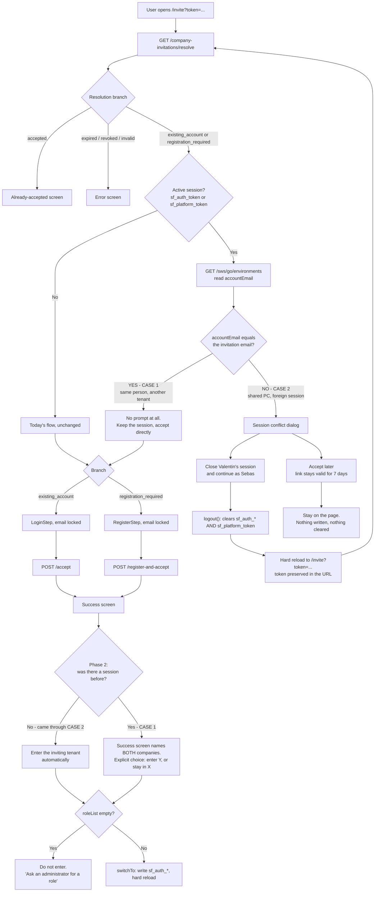
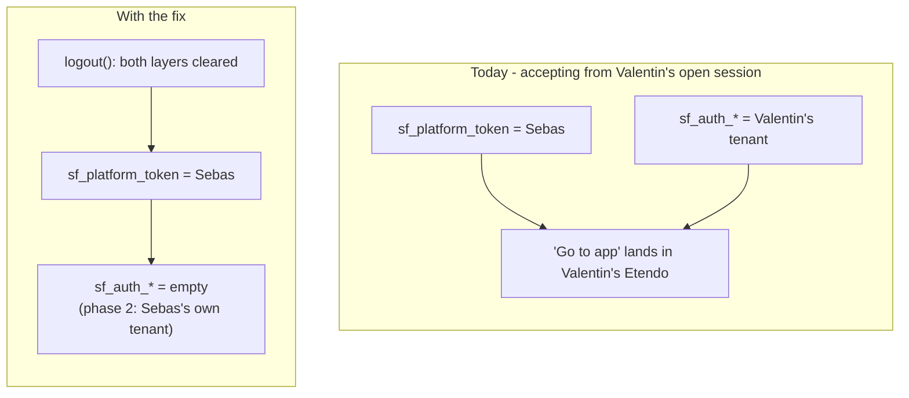

# ETP-5202 — Accepting an invitation must not leave a foreign session open

**Status:** proposed
**Jira:** ETP-5202 (resolved under the ETP-5216 umbrella, branch `feature/ETP-5216`)
**Scope:** `tools/app-shell` only — no core package change, no backend change, no version bump.

---

## 1. The defect

Reported: *"Al aceptar una invitación para crear una nueva cuenta mientras se está logueado en otra
cuenta, el sistema crea la nueva cuenta pero no cierra la sesión original."*

The driving scenario is a **shared computer**: Valentín leaves his session open, Sebas opens the
invitation link that was emailed to him, and both identities end up live in the same browser.

## 2. How the mechanism works today

### 2.1 Two identity layers, not one

| Layer | What it is | Browser storage |
|---|---|---|
| **Platform account** (`ETGO Account`) | The Etendo Go user: email + password hash + `session_token`. Owns N environments. | `sf_platform_token`, `sf_platform_auth_method` |
| **Tenant session** (NEO JWT) | The effective login into one client, with its `AD_User`, role list and selected role/org. | `sf_auth_token`, `sf_auth_user`, `sf_auth_client_id`, `sf_auth_client_name`, `sf_auth_rolelist`, `sf_auth_selected_role`, `sf_auth_selected_org` |

Crossing from one to the other happens in `useEnvironmentSwitch.switchTo()`: the platform token
lists the account's environments, `loginEnvironment(env)` returns the tenant JWT, and
`buildEnvironmentSessionStorage` (`etendo-go-core/onboarding/state.js`) is the single writer of the
`sf_auth_*` keys. The only place that clears **both** layers is
`createLocalAuthStorage().clear()` (`app-shell-core/auth/session.js`), reached through
`AuthContext.logout()`.

### 2.2 Invitation lifecycle (backend — `CompanyInvitationService.java`)

- **Create** (from `InviteUserDialog`, Users window): creates the `AD_User` in the inviter's client
  plus an `Invitation` row holding `client`, `organization`, `user`, `email`, the **token hash**
  (the cleartext 32-byte token only ever travels in the email), status `PENDING`, and `expiresAt`
  at **7 days**. The email links to `…/invite?token=<cleartext>`.
- **`GET /sws/go/company-invitations/resolve?token=`** — anonymous. Looks the invitation up by hash
  and returns one branch: `accepted`, an `EXPIRED_TOKEN` error, `existing_account` (an active
  `Account` already exists for that email), or `registration_required`. **It never inspects who is
  logged in.**
- **`POST /accept`** (`existing_account`) — requires `sf_platform_token` as bearer, and enforces
  that the authenticated account's email **matches the invitation** (`INVITATION_ACCOUNT_MISMATCH`,
  403). Marks the invitation `ACCEPTED`.
- **`POST /register-and-accept`** (`registration_required`) — anonymous. Creates the `Account` bound
  to the invitation email, marks the invitation `ACCEPTED`, and returns a fresh **platform** session
  token.

The backend is sound: an invitation can never be accepted by the wrong account.

### 2.3 Where it breaks (frontend)

`InviteAcceptancePage.jsx` is a **public** route (`runtime-routes.jsx`), but public routes still
render **inside** the `AuthProvider` (`AppShellRuntime.jsx` wraps everything; the public filter only
takes them out of the layout). So the page has access to the session and to `logout()`, and uses
neither.

The page **only ever writes `sf_platform_token`** and never touches `sf_auth_*`:

- `registration_required` → `RegisterStep.handleAuthSuccess` sets `sf_platform_token`
- `existing_account` → `LoginStep.handleAuthSuccess` sets `sf_platform_token`

Accepting from Valentín's open session therefore leaves:

```
sf_platform_token  ->  Sebas          (overwritten)
sf_auth_token      ->  Valentín's tenant (untouched)
sf_auth_client_id  ->  Valentín's client (untouched)
```

"Go to app" navigates to `/dashboard`, a private route validated against `sf_auth_token`:
**Sebas lands inside Valentín's Etendo.**

### 2.4 Why this is worse than "the session stayed open"

The two identities are *interleaved* in the same tab, and which one wins depends on which module
reads first, because the fallbacks are inverted relative to each other:

| Consumer | Reads | Resolves to |
|---|---|---|
| `useEnvironmentSwitch.js` | `sf_platform_token \|\| sf_auth_token` | **Sebas** |
| `lib/upgrade/api.js` | `sf_auth_token \|\| sf_platform_token` | **Valentín** |
| `lib/flags/useAccountIdentity.js` | `sf_platform_token` | **Sebas** |
| All NEO traffic (`useApiFetch`) | `sf_auth_token` | **Valentín** |
| `ChangePasswordDialog.jsx`, `lib/authMethodsApi.js` | `sf_platform_token` | **Sebas** |

The last row is the sharpest edge: a password change performed in that state hits Sebas's account
while the UI is showing Valentín's tenant.

---

## 3. Proposed behaviour

Intercept **on mount, after `resolve`, before anything is written**. The check is not "is a session
open?" but "**is the open session a different person?**".



Note the loop `P -> B`: after the logout-and-reload there is no session left, so the second pass
falls straight through `F -> G` into the normal flow. No special "post-logout" state to maintain.

### Case 1 — same person, another tenant (no prompt)

Sebas is already signed in with **his** account in Company X and is invited to Company Y. Asking him
to close his own session is pure noise. `resolve` returns the invitation `email` in cleartext on the
actionable branches, and `/sws/go/environments` returns the signed-in `accountEmail`; when they
match, accept directly.

This will be the common case as soon as multi-tenant use is normal, which is why it must not be
swept into the "foreign session" prompt.

**But silence is its own hazard here.** Case 2 is loud — a dialog, a logout, a login; the user
cannot miss that something changed. Case 1 is completely silent: accept, see "done", press "Go to
app", and land back exactly where you were, in the OLD tenant, with nothing on screen saying you now
belong to another company. That is a real way to keep working in X believing you are in Y.

The fix is to break the silence on the **success screen**, naming both companies, rather than to
move the user automatically:

> **You are now part of Company Y**
> You are currently working in **Company X**.
> `[ Enter Company Y ]`  `[ Stay in Company X ]`

Automatic switching is the wrong default for Case 1 specifically, because that user *was in the
middle of something*: `switchTo()` ends in `window.location.href = '/'` — a deliberate hard reload,
since every per-tenant cache has to go — so an unsaved invoice in the other tab dies because someone
clicked a link in an email. And the caution cannot be applied selectively: `hasUnsavedChanges()` is
in-memory state belonging to the tab that owns it, so the `/invite` tab has no way to know whether
another tab has unsaved work. When you cannot know it is safe, ask.

### Case 2 — shared PC, foreign session (the ticket's scenario)

Two actions, no third:

- **"Close Valentín's session and continue as Sebas"** — name both people. Warn that the session
  closes **in every tab**: `logout()` wipes `localStorage`, so Valentín's other tabs die on their
  next request (401 → auto-logout), and `installUnloadGuard` does not protect them because no
  navigation happens there. Anything he had half-written is lost. That is what the ticket asks for,
  but it must not be a surprise.
- **"Accept later"** — say the link keeps working. The invitation lives **7 days** from the send, so
  deferring is safe and needs no resend.

Rejected as buttons: *"accept without closing the session"* (that is the bug), and *"open a private
window"* (advice, not an action the app can perform — fine as helper text).

### Storage before and after



---

## 4. Ordering constraints (these are the easy things to get wrong)

1. **Log the previous user out BEFORE asking the new one for credentials — never after accepting.**
   A logout at the end still passes through the mixed state, just faster: `sf_platform_token` is
   already Sebas's while `sf_auth_*` is still Valentín's tenant, which is exactly the window in
   which `ChangePasswordDialog` / `authMethodsApi` would target the wrong account. With the dialog
   first, Sebas never types his password into a tab where somebody else's session is live.

2. **Preserve `?token=` across the logout.** The page's `clearTokenFromUrl()` `replaceState`s to a
   bare `/invite`; if it runs on the logout path, Sebas is left on a `missing_token` error *after*
   Valentín's session was destroyed — both things broken. `clearTokenFromUrl()` must run only once
   the invitation has actually been accepted.

3. **Reload hard after the logout.** `logout()` clears storage, but the SPA keeps every per-tenant
   cache alive in memory. This is precisely why `switchTo()` does `window.location.href = '/'`
   instead of a state update ("anything cached per tenant must not survive"). On a shared PC the
   whole point is that the next person sees nothing of the previous one, so reload to
   `/invite?token=…` — which also makes constraint 2 fall out for free, since the token rides in
   the URL.

4. **`sf_account_email` is not cleared on logout.** `lib/flags/bootstrap.js` caches the account
   email under `sf_account_email`, and `createLocalAuthStorage().clear()` does **not** remove it
   (it only clears the `sf_auth_*` keys plus `sf_platform_token`). So it can be stale from a
   previous session. Consequences: (a) it must not be the authoritative source for the identity
   comparison — the live `/sws/go/environments` response is; (b) it should be cleared on logout,
   which can be done from `clearSessionScopedState` in `App.jsx` (already wired to
   `AuthProvider.onSessionChange`) without touching the core package.

---

## 5. Implementation plan

### Phase 1 — the session-conflict guard (closes ETP-5202)

1. `InviteAcceptancePage.jsx`: after `resolve` succeeds on an actionable branch, detect an active
   session (`sf_auth_token` or `sf_platform_token`) and resolve the signed-in `accountEmail` from
   `/sws/go/environments`. Compare case-insensitively against the invitation email.
2. Same email → current behaviour, no prompt.
3. Different email (or the account email cannot be resolved — fail safe by prompting) → render the
   conflict dialog instead of `LoginStep`/`RegisterStep`.
4. "Close and continue" → `useAuthOptional().logout()` (the page renders inside the `AuthProvider`),
   then `window.location.replace('/invite?token=…')`. Never touch `localStorage` by hand.
5. "Accept later" → a terminal informational state; nothing written, nothing cleared.
6. Clear `sf_account_email` from `clearSessionScopedState` in `App.jsx`.
7. i18n: new keys in **both** `en_US.json` and `es_ES.json` (and `es_AR.json`, which the repo also
   ships). The dialog names both people, so the strings take `{currentUser}` / `{invitedEmail}`
   placeholders.

### Phase 2 — reaching the inviting tenant after accepting (separate commit)

Two different behaviours, decided by whether a session existed when the page was opened:

- **Came through Case 2** (no session left after the logout, or none to begin with): enter the
  inviting tenant **automatically**. There is no prior context to destroy.
- **Case 1** (the user's own session is live in another tenant): do **not** switch automatically.
  Render the success screen naming both companies and let the user choose — see the rationale in
  section 3.

The machinery already exists: `useEnvironmentSwitch.enterByClientName(clientName)` was written for
exactly this (re-fetch the environment list, then `switchTo`, ending in a full page load), and both
`accept` and `register-and-accept` return `clientName`. The invited user does appear in
`/sws/go/environments`, which links by `AD_User.username == account email`.

**The trap that must be handled first:** an invited user can have **zero roles**. The code says so
twice (ETP-4830): an admin-created user has no roles at invite time; role assignment happens later
through the "Roles del usuario" tab. And `GET /sws/go/login?userId=` does **not** fail in that case
— `writeEnvironmentLoginResponse` calls `generateToken(user, null)` and returns a JWT with no role
and `roleList: []`. Auto-entering blindly would drop the user into an empty or broken app, which is
a worse bug than the one being fixed.

So: check `roleList` is non-empty before writing the session. If empty, show "your access has not
been configured yet, ask an administrator to assign you a role" and do not enter.

---

## 6. Files expected to change

| File | Change |
|---|---|
| `tools/app-shell/src/pages/InviteAcceptancePage.jsx` | The guard, the dialog, the logout-and-reload path |
| `tools/app-shell/src/App.jsx` | Clear `sf_account_email` in `clearSessionScopedState` |
| `tools/app-shell/src/locales/{en_US,es_ES,es_AR}.json` | Dialog strings |
| `tools/app-shell/src/pages/__tests__/InviteAcceptancePage*.vitest.jsx` | Cases below (delegated to Tester) |

No change in `schema_forge_core` and none in `com.etendoerp.go`, so **no preview publish and no
version bump**.

## 7. Test plan

Unit (Vitest, written by Tester):

1. No session + `registration_required` → no dialog, `RegisterStep` renders (regression guard).
2. Session whose `accountEmail` equals the invitation email → no dialog (Case 1).
3. Session with a different `accountEmail` → dialog, and `LoginStep`/`RegisterStep` is **not**
   rendered.
4. `/environments` fails or returns no email while a session exists → dialog (fail safe).
5. "Close and continue" calls `logout()` and navigates to a URL that **still carries the token**.
6. "Accept later" writes nothing and clears nothing.
7. `resolve` returning `accepted` / expired → no dialog even with a foreign session open.
8. `clearSessionScopedState` removes `sf_account_email` when the session loses its token.

Phase 2 additions:

9. Case 1 success screen names both companies and offers both actions; neither is taken
   automatically.
10. Case 2 success enters the inviting tenant without asking.
11. `roleList: []` blocks the switch in both cases and shows the "ask an administrator" message
    instead of writing `sf_auth_*`.

Manual, on the running app (localhost:3100), which is where this has to be proven:

- Sign in as A, open B's invitation link in the same tab, confirm the dialog names both, accept the
  logout, and verify that `localStorage` afterwards holds **no** `sf_auth_*` key and that the token
  survived in the URL.
- Repeat with A == the invited account and confirm no dialog appears.
