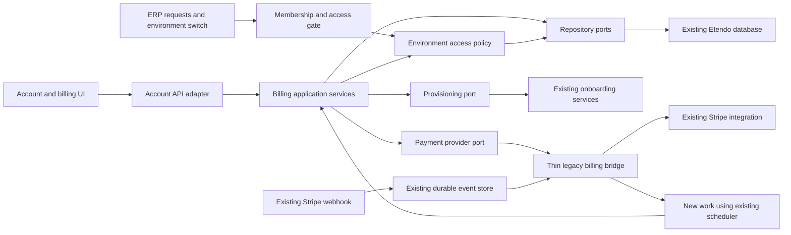

# ETP-5396 — Demo-to-PRO technical design

- **Date:** 2026-09-17
- **Status:** Proposed implementation design; no runtime changes or functional validation are delivered by this document.
- **Product contract:** [ETP-5396 PRD](etp-5396-demo-to-pro-prd.md).
- **Task:** [ETP-5396](https://etendoproject.atlassian.net/browse/ETP-5396).
- **Decision:** A modular monolith with application-owned ports for new functionality. A thin bridge reuses the existing Stripe integration. Keep the existing backend, database, identity system, frontend design system, and deployment; do not refactor existing Stripe coupling.

## 1. Baseline and integration contract

Use the **final `feature/ETP-5045-2` delivery** and the corresponding `com.etendoerp.go` `feature/ETP-5045` backend as the implementation base. Include both checkout-request persistence and billing-event persistence. Do not reproduce the earlier in-memory registry or assume billing events remain unfinished.

The following snapshots were inspected on 2026-09-17. They are evidence of current seams, not a declaration that a moving branch is frozen, merged, or manually validated. At implementation start, record the final integrated SHAs and compare the seams below. This documentation branch is based on `develop`; it does not merge or publish the prerequisite code.

| Source | Inspected revision | Evidence |
| --- | --- | --- |
| Schema Forge `feature/ETP-5045-2` | `a86b4532b5db583db897d61ed5c5c76a90981620` | [Durable payment state](https://github.com/etendosoftware/etendo_schema_forge/blob/a86b4532b5db583db897d61ed5c5c76a90981620/docs/etp-5045-durable-payment-state.md) |
| Etendo Go `feature/ETP-5045` | `a90c34519eaf1f203fed3d4ad8850cbf2a3189bc` | [Payment package](https://github.com/etendosoftware/com.etendoerp.go/tree/a90c34519eaf1f203fed3d4ad8850cbf2a3189bc/src/com/etendoerp/go/payment) |

### Reuse and gaps confirmed in that baseline

| Existing seam | Reuse | New integration / functional work |
| --- | --- | --- |
| `CheckoutRequestStore`, `ETGO_CHECKOUT_REQUEST` | Durable request, account FK, existing Stripe references, lifecycle, attempts and timestamps | New application layer authorizes by account ID and links its durable provisioning work to the existing request; no provider-field rename/backfill |
| `BillingEventStore`, `ETGO_BILLING_EVENT` | Durable receipt, event deduplication, audit summary; existing `PROVIDER` field | New recovery work reads existing durable evidence through the bridge; preserve existing event schema and constraints |
| `CheckoutWebhookProcessor` / verifier | Verify signature before parsing/claiming; existing test seam | Leave current verification and endpoint contract in place; new logic consumes normalized confirmed facts through the bridge |
| `HostedCheckoutService` | Current Stripe hosted checkout integration and server-selected price | Delegate from the new boundary; do not rewrite transport, pricing configuration or provider idempotency. Ambiguous results become visible reconciliation work |
| `TenantPaywallService` | Testable separation of provisioning permission and productive result | Remove conversion; distinguish actual ownership from membership; require a durable purchase-to-new-tenant binding |
| `TenantPlanService` | Existing `ETGO_TenantPlan` compatibility preference | Stop treating plan label as a complete access policy; keep compatibility while new state is authoritative |
| `OwnerSupport` | `AD_User.EM_ETGO_Is_Owner`, scoped to the user's client | Combine with trusted account-to-user resolution. Historical users can all have `N`; use reviewed owner backfill, not an administrator-name heuristic |
| Account servlet and identity helpers | Existing account session, account settings and environment discovery | Account-only billing routes, stable identifiers and explicitly filtered owner/member views |
| `NeoAuthenticator` | Central NEO JWT authentication and client context | Invoke a shared eligibility gate after resolving authenticated tenant context; distinguish commercial denial from invalid identity |
| `UpgradePage.jsx` and `lib/upgrade/api.js` | Checkout creation/status and onboarding UI | Remove `convert-demo`, remove session-storage recovery dependency, prefer account session for account actions, render backend plan data |
| `runtime-routes.jsx` | Existing account/upgrade routes | Both use the private route helper today. Add explicit account-only guard/layout; comments calling them public do not establish that behavior |
| Existing Contacts/Product Export/Import | Supported formats, field mappings, validation and progress | Add transfer guidance; do not implement a tenant clone |

The baseline claims events at most once: a crash after committing `RECEIVED` can suppress further application of that event. Its atomic `PAID -> PROVISIONING` claim prevents an ordinary duplicate claim but does not resume a crashed provisioning attempt. ETP-5396/5048 must address both; durable storage alone is not eventual recovery.

Reuse the baseline recurring-billing PRD's commercial models where applicable. Its existing Stripe implementation remains in place. New domain/application contracts must not expose Stripe SDK objects, event types or price IDs; that rule does not retroactively require changing legacy contracts.

### Explicit scope boundary

| In this task | Deferred existing-Stripe work |
| --- | --- |
| New lifecycle/access/owner rules and account UI behind narrow neutral contracts | Rewriting existing checkout or webhook code to be provider-neutral |
| A thin bridge translating existing results for new consumers | Renaming `STRIPE_*` columns, backfilling generic provider bindings or replacing legacy tables |
| New durable provisioning/reconciliation work needed for the requested behavior | Changing legacy external-ID uniqueness to support multiple providers/merchants |
| New renewal/management integration, only where required, confined to an adapter | General Stripe HTTP, SDK, timeout or outbound-idempotency cleanup |
| Functional edits such as rejecting conversion and enforcing tenant expiry | Moving all existing billing consumers onto a new abstraction |

Functional changes required by the PRD remain in scope even when their call sites are legacy files. They do not authorize a Stripe decoupling project. Deferred debt is recorded below and is not a release gate for the new boundary.

## 2. Module boundaries



All boxes initially run in the existing application. The diagram describes dependencies, not deployment units. Account space can remain reachable when an ERP tenant is commercially blocked; it does not provide independent uptime from the shared backend.

Suggested package organization under `com.etendoerp.go.billing`:

| Area | Responsibility | May depend on |
| --- | --- | --- |
| `domain` | Trial/deadline rules, entitlement decisions, immutable identifiers/value objects | Java types and injected clock only |
| `application` | Start purchase, apply normalized billing state, request/retry provisioning, query overview | Domain and narrow ports |
| `ports` | Provider, repository, owner lookup, provisioning, clock contracts | Domain/application DTOs |
| `adapters` | Thin legacy payment bridge, any required new provider operations, DAL persistence, servlet mapping, scheduler and onboarding bridges | Existing payment services and provider/DAL/framework implementations |

Names are proposed; adapt to the final backend layout. New consumers depend on the bridge; existing payment consumers do not have to migrate. Retain current Stripe classes, routes and tables. Do not relocate authentication/onboarding code or create an interface for every helper. Place only external systems and cross-module responsibilities used by the new functionality behind ports. No window-specific logic belongs in generic NEO CRUD/selector services.

The UI calls account/billing application endpoints. Other modules ask an `EnvironmentAccessService` for eligibility; they do not query provider fields or implement their own `past_due` rules.

## 3. Provider independence

### 3.1 Required contract

Define the port from Etendo use cases, not from Stripe API method names. The following is illustrative pseudocode, not a proposed public SDK:

```text
BillingPaymentPort
  capabilities() -> PaymentCapabilities
  startCheckout(PurchaseIntent) -> CheckoutHandle | NeedsReconciliation
  inspectPurchase(CheckoutHandle) -> CheckoutSnapshot
  readSubscription(BillingReference) -> SubscriptionSnapshot

OptionalBillingManagementPort
  createManagementSession(BillingReference, allowedReturnUrl)
    -> ManagementSession | UnsupportedCapability

BillingChangeSource
  readChanges(cursor) -> NormalizedBillingChange[]
```

`PurchaseIntent` contains the new internal operation/account/plan IDs, a validated company/demo association, immutable provisioning-input reference, and a server-selected offer reference. It never accepts a browser-supplied amount, customer ID, provider choice or arbitrary return URL. The legacy bridge maps this to the existing configured checkout offer; it does not replace Stripe pricing configuration.

`CheckoutHandle` contains an opaque integration reference (the existing request ID for the legacy bridge), an allowed redirect URL, and optional expiry. `CheckoutSnapshot` expresses `OPEN`, `CONFIRMED`, `FAILED`, `EXPIRED`, or `UNKNOWN`, payment/zero-amount authorization and known offer/correlation facts. A `SubscriptionSnapshot` expresses paid-through time, effective cancellation and unresolved renewal obligations with due times. `BillingReference` is opaque outside the adapter. Provider-native status may remain in existing records, never used directly by the new access policy.

`NormalizedBillingChange` carries a source/reference, observation time and category such as `CHECKOUT_CHANGED`, `SUBSCRIPTION_CHANGED`, or `RENEWAL_CHANGED`. It requests reconciliation, not an access grant. Initially the bridge reads existing durable records and normalizes them. New renewal-specific calls, if absent in final ETP-5046/5048, are implemented in the adapter as new functionality; current checkout/webhook paths are not rewritten.

Snapshots can explicitly be incomplete/unknown. Never invent a paid-through date or clear debt when an adapter cannot establish it. The provider adapter owns interpretation of delayed payments, zero-amount invoices and provider-specific retries. Etendo owns trial, grace, membership and access decisions.

### 3.2 New capability boundary

New application records may store an integration source plus opaque reference, so they do not interpret Stripe identifiers. The bridge retains the current provider/environment configuration. Secrets stay in server configuration/secret storage. Do not introduce a provider registry or backfill historical merchant/live/test bindings as part of this task.

There is no provider-switching UI or configuration feature in this delivery. A future provider implementation must retain the association of existing subscriptions with their original integration. Migrating them, their payment methods or legacy references requires a separate task.

Expose only capabilities needed by new flows: starting checkout, reading confirmed purchase/subscription state, and optional management actions. Explicitly report unsupported/uncertain results. The existing integration does not gain a safe remote-retry guarantee merely because it is behind a port. The new orchestrator deduplicates local submissions and stops for reconciliation on ambiguous remote creation instead of calling it again blindly. The UI consumes supported actions, not `provider == stripe` checks.

Implement the thin legacy bridge now. Use a small neutral fake in tests to prove independence of the new policy/orchestration; do not claim that the whole legacy billing subsystem becomes provider-neutral. Existing Stripe simulators remain regression tools. A second real integration or plugin framework is out of scope.

### 3.3 Preserve ETP-5045 persistence

Keep existing tables, rows, request IDs, Stripe fields, event constraints and terminal outcomes. The bridge reads the current `STRIPE_SESSION_ID`, `STRIPE_CUSTOMER_ID` and `STRIPE_SUBSCRIPTION_ID` internally. It returns normalized facts to new consumers; it does not rename columns or dual-write a replacement provider model.

Add only lifecycle/work metadata required for this feature, preferably as a small new record linked to the existing checkout request. This record owns input snapshots, target reservation, leases and recovery checkpoints; the old checkout record remains payment evidence. Reuse a suitable ETP-5048 work record if one exists rather than creating another queue.

Known deferred debt: `ETGO_BILLING_EVENT` deduplicates by external `EVENT_ID` alone, and checkout-session uniqueness uses a Stripe field. Do not generalize these constraints now. A future multi-provider integration must address those legacy limits before routing other providers through these stores.

Also deferred: existing Stripe transport timeout/idempotency cleanup and moving old consumers behind ports. None is a prerequisite for isolating the new code. Surface their limitations through explicit uncertain/reconciliation outcomes rather than promising behavior the legacy integration cannot supply.

## 4. Identity and ownership

Use the existing platform account session for account/billing endpoints. Do not require an active ERP JWT or route these endpoints through a tenant eligibility check. An ERP JWT is tenant-scoped and must not authorize actions for arbitrary companies.

Resolve a billing owner through trusted account-to-environment-user mapping plus the client-scoped owner flag/authoritative ownership record. The existing email/suffixed-username environment search discovers memberships; it is not sufficient ownership proof. Prefer stable account IDs for payment ownership; the checkout table already has an account FK. Email remains a display/notification attribute and compatibility input only.

For a new productive purchase, verify ownership of the selected source demo. For an account with no owned demo, allow only its own new-company purchase intent; never bind an invited company's demo. Once production exists, its owner and subscription billing authority must agree before further owner actions are enabled.

If historical account/owner linkage cannot be established, fail closed for billing mutations and expose a support-resolution status. Preserve existing valid company membership access. Implement audited ownership correction rather than choosing the first administrator. Revalidate after any ownership change; a stale page cannot retain billing authority.

The server returns `canEnter`, `canManageBilling`, and supported billing actions for each environment. These guide the UI; the server repeats authorization on every request. Account-scoped queries filter before reading or returning financial details.

## 5. Local data model

This is a logical model. Reuse ETP-5046's final plan/subscription schema instead of creating a competing subscription table. Resolve actual AD identifiers through repository/database tooling during implementation; no guessed AD IDs are defined here.

| Record | Required information / invariants |
| --- | --- |
| Environment lifecycle | Tenant ID (unique), immutable `DEMO/PRODUCTIVE` type, readiness, trial start/expiry, policy version/duration, transition cohort/expiry and explicit entitlement origin. A missing row is an unresolved classification, not unlimited use |
| Subscription projection/association | Reuse ETP-5046's commercial record through a repository adapter, even if its persistence is Stripe-specific. New model exposes internal ID, owner account ID, opaque billing reference, plan, productive/demo association, paid-through, cancellation, grace and reconciliation version |
| Purchase/provisioning work (new or reuse ETP-5048) | Unique internal operation/account ID and optional unique legacy request link, immutable offer/input snapshot, selected owned demo, reserved target tenant, lifecycle/checkpoints, lease/fencing token and retry metadata. Do not duplicate the payment ledger |
| Billing event (existing) | Preserve its schema and deduplication. The new work record stores its own reconciliation cursor/lease and consumes normalized observations without assuming legacy `RECEIVED` is fully applied |
| Offer projection | New API maps an internal offer to the current configured checkout offer and its display metadata via the bridge. No generic provider-offer catalog or migration of existing Stripe configuration |
| Legacy entitlement | Explicit reviewed grant and reason for existing productive environments lacking managed subscription state; auditable provenance and optional expiry |

Subscription-to-environment constraints enforce one productive tenant per purchase and the initial one-subscription/one-productive/optional-one-demo association. Prevent a demo being attached to unrelated owners or multiple active subscriptions under this initial model. Re-purchase after cancellation must resolve the existing company/subscription relationship rather than allocating another environment accidentally.

Use existing 32-character Etendo record IDs for local FK/PK columns. The existing checkout `REQUEST_ID` is up to 64 characters; provider references use adequately sized external-ID fields (currently 255 in ETP-5045). Do not put provider IDs or 36-character UUID request IDs into a 32-character record primary key.

Persist three separate policy settings with initial value 15: demo trial days, renewal grace days, and existing-demo transition days. Snapshot assigned intervals; never compute a previously assigned deadline from today's configuration. Enforce UTC instants and nonnegative validated configuration.

For expired managed demos without a subscription, retain the historical trial. Payment grants an additional entitlement to the associated demo; it does not rewrite trial dates. If the subscription later becomes ineligible, any genuinely remaining original trial still applies.

## 6. Access policy and enforcement

The first implementation slice is the provider-neutral `EnvironmentAccessPolicy` in
`com.etendoerp.go.payment`. It validates the configured trial duration, starts the demo clock from
the persisted trial start instant, treats the exact deadline as expired, and evaluates membership
before commercial eligibility. A current subscription grants access to both demo and productive
environments; invitations therefore remain independent from the account that owns billing. The
policy is intentionally pure and receives the current time and configuration from its caller, so
database adapters and request filters can share the same decision without contacting Stripe or any
other provider on the request path.

The NEO authentication adapter now applies this decision after resolving the JWT client and before
dispatching CRUD or process work. Commercial denial is returned as HTTP 402 while the account
session remains available for billing actions. A tenant without lifecycle metadata is intentionally
left for the legacy transition step; this avoids assigning an invented historical trial date.

Productive lifecycle metadata also stores a neutral subscription status and renewal due instant.
`CURRENT` and reviewed `LEGACY_ENTITLEMENT` states allow access; `PAST_DUE` remains usable only
before `dueAt + configuredGraceDays`, with an initial grace period of 15 days. The equality boundary
is suspended. A future billing reconciler can update this projection without changing the policy or
the existing Stripe transport.

### Decision order

```text
authenticate identity and resolve trusted target tenant
validate active membership and existing role/resource permission
load target environment lifecycle and its local entitlement snapshot
if environment is not ready: deny entry as provisioning
if explicit valid legacy entitlement: allow
if associated subscription provides current paid access or unexpired grace: allow
if target is DEMO and original trial or assigned transition is unexpired: allow
otherwise: deny with a stable commercial reason and allowed account actions
```

Use an injected clock. Equality with a deadline is expired. Evaluate the destination tenant, never the requesting person's unrelated subscription. Commercial eligibility is an additional gate, not a replacement for existing ERP authorization. Owners and tenant administrators receive no bypass.

Initially read local eligibility once per request, reusing it within that request. Do not call the payment provider on the request path. Avoid distributed caching until needed; any later cache must expire no later than the next policy boundary and invalidate on entitlement changes. JWT issuance time does not freeze commercial access until token expiry.

Apply one shared policy through adapters at all supported tenant entry points:

| Entry point | Enforcement requirement |
| --- | --- |
| Environment login/switch and token refresh | Refuse issuing usable tenant context for an ineligible environment; retain account session |
| NEO requests through `NeoAuthenticator` | Evaluate after trusted user/client resolution, before CRUD, process, report, export or other tenant work |
| MCP/OAuth tool dispatch | Enforce after resolving principal/tenant and before tool execution; no alternate protocol bypass |
| Other SWS/Go data routes, imports, attachment downloads, background submissions initiated by users | Inventory and apply the shared gate before reading/writing tenant data; include any direct route not passing NEO |
| Public API gateway when integrated | API-key authentication resolves tenant; apply the same policy before dispatch |
| Classic interactive entry, if available to these SaaS tenant roles | Verify coverage by the same eligibility service or deny that entry for managed tenants. Do not claim all-role expiry with an unguarded alternate entry |

Entry-point inventory is a release gate. This table does not assert that the existing NEO hook covers all transports. Do not inject window-specific billing checks into CRUD handlers. Batch imports and long-running user jobs must check eligibility at start and at safe continuation/commit boundaries; already completed transactions are not reversed on clock expiry.

An explicit allowlist separates account endpoints, authenticated provider callbacks, reconciliation, and provisioning workers from tenant-data entry. Each keeps its own authentication/authorization. Do not exempt all `/sws/go/*` routes by prefix. System repair jobs are not a tenant administrator's interactive bypass.

Use 401 for invalid identity, 403 for missing permission, and a stable 402 commercial-access response for an authenticated/authorized but ineligible tenant. Account-scoped opaque resource lookups return a consistent non-disclosing result. Preserve existing checkout-status compatibility for unknown/foreign IDs until a versioned contract replaces it. Database/policy-evaluation failure returns a retriable 503; it never grants access or mislabels the account as expired.

## 7. Purchase, event and provisioning flows

### 7.1 Start or resume purchase

1. Authenticate account; verify company ownership and allowed new-environment action.
2. Validate selected internal offer and complete provisioning inputs. Freeze inputs server-side before checkout; changing the company name/association after payment is not a way to redeem against another tenant.
3. Persist new work with a unique account-scoped operation key. Deduplicate repeated submission, including concurrent clicks/tabs, using an active-purchase constraint for the intended demo-to-production transition.
4. Claim the start operation once and delegate to existing checkout through the bridge. Record the legacy request link and returned URL when available. A local operation key is not a claim of remote Stripe idempotency.
5. On an ambiguous failure, mark `NEEDS_RECONCILIATION` and prevent another outbound creation. Recover from existing durable evidence when it can be correlated authoritatively; otherwise expose a support action. Do not automatically pair a payment by company name/email/time similarity or assume no payment happened.

Baseline `CREATING` rows without a returned provider ID are uncertain outbound attempts. The current service generates its own request ID; a process failure before the bridge saves that link may require explicit support correlation. Preserve that limitation instead of silently adding a Stripe transport refactor to this task. Once the purchase is confirmed and linked, provisioning recovery is fully server-driven and never invokes checkout again.

### 7.2 Receive and reconcile provider changes

1. Keep the current Stripe webhook, signature verification and durable event receipt unchanged. New code does not accept browser claims as billing evidence.
2. The bridge exposes normalized observations from existing durable records and, for new renewal behavior, authoritative subscription inspection. Polling/reconciliation remains necessary because legacy event receipt is not guaranteed application.
3. A worker claims the new pending/failed/stale reconciliation work with an expiring lease and fencing token. Existing `APPLIED` events remain terminal; new work does not reset or repurpose their result.
4. Resolve the internal purchase/subscription from trusted persisted association. Unknown or incomplete correlation stays visible and retryable/support-actionable in the new work state. Do not grant access from a guessed association.
5. Serialize reconciliation per local subscription/purchase. Read authoritative state through the bridge/new provider adapter operation; apply only while holding the valid lease/version. Event timestamps alone are not ordering authority.
6. In a local transaction, persist the normalized commercial snapshot, audit outcome and durable provisioning/recovery checkpoint. If reconciliation confirms a checkout the old handler missed, the bridge uses the existing checkout-store operation to converge that payment record; it does not invent a second payment authority. Account for the store's existing independent commits with recoverable checkpoints. A reconciliation cursor advances only after the required local effects are committed. Do not rewrite the legacy event ledger to pretend it processed the new feature.

Re-delivery and repeated scans are normal. The new worker provides repeatable reconciliation with idempotent effects, not distributed exactly-once execution. A stale legacy `RECEIVED` row triggers inspection/reconciliation through the bridge; it is not blindly replayed through the old at-most-once handler. If available references cannot establish the result, retain an explicit unresolved state for support. Do not store raw card/customer payloads to work around incomplete references.

Stripe duplicates/unordered delivery and fulfillment retries motivate the new recovery logic, but do not require refactoring its current webhook implementation. See [Stripe webhook delivery](https://docs.stripe.com/webhooks) and [Checkout fulfillment](https://docs.stripe.com/checkout/fulfillment).

### 7.3 Provision new production

Keep the existing payment lifecycle intact, and let the new work record track orchestration/checkpoints alongside it:

```text
CREATING -> CREATED -> PAID -> PROVISIONING -> PROVISIONED
```

Failures, lease expiry and retry schedule belong to the new work record rather than resetting a confirmed purchase to unpaid. The bridge maps legacy payment evidence to a normalized confirmed purchase, including an allowed zero-amount offer. Keep a single authority for money: do not create a competing paid/unpaid ledger.

The new work state distinguishes waiting for confirmation, ready to provision, provisioning, ready, retryable failure and needs reconciliation. Only normalized authoritative confirmation enables the ready-to-provision transition. Only a proven unpaid expired/cancelled checkout can release an active purchase for a fresh attempt; a timeout alone cannot. These work states describe orchestration and do not override the legacy payment record.

- A confirmed purchase is durable work independent of browser polling. Use the existing scheduler infrastructure to find `PAID` and stale/retryable `PROVISIONING` requests; no external broker is necessary.
- Before creating tenant data, reserve and persist a unique target tenant identity for the purchase. Add a unique purchase-to-target relation and make onboarding resume by that identity, not company name alone. The source demo ID must differ from the target.
- Claim new provisioning work by compare-and-set under a lease. Fence every checkpoint write, renew while active, and prevent a resumed old worker from writing after lease loss. Existing rank-based state setters and a single initial claim are not sufficient for multi-node restart safety; the new orchestration owns these guarantees without generalizing Stripe fields.
- Bridge to existing onboarding services. Audit which steps commit independently and make their side effects idempotent or protected by unique business keys. Persist progress; a failed dataset import must resume the same target and must not consume payment irrecoverably.
- When production is ready, atomically record its association/readiness and `PROVISIONED` outcome wherever possible. If separate commits are unavoidable, reconcile from persisted target state before rerunning side effects.
- `retry` schedules eligible repair of the same purchase. It never starts checkout. A repeated/concurrent request returns the same work record/result.

Failing to find all required immutable onboarding inputs is a pre-checkout validation error. The current browser-held company/action state and mutable wizard draft are not a sufficient server-recovery contract.

### 7.4 Renewal grace

Store the oldest unresolved eligible renewal obligation's due time when delinquency begins and snapshot `graceUntil = dueAt + configuredGraceDays`. A repeated failure does not move it. If a late event is received after that deadline, do not grant a new 15 days from receipt.

Reconcile remaining debt and paid-through state before restoring access. Clear delinquency only when the obligation set justifies it. A later independent delinquency can start a new period; outstanding uninterrupted debt cannot. Provider collection status alone does not dictate access. Scheduled cancellation respects its paid-through boundary; a cancelled service without debt does not earn grace.

## 8. API and frontend contracts

Paths below marked proposed are additive design, not existing endpoints. Use existing account authentication and error conventions where compatible.

| Endpoint | Status / behavior |
| --- | --- |
| `GET /sws/go/environments` | Existing; add type, readiness, access reason/deadline, relationship and capabilities. Include blocked memberships for safe account navigation; omit financial details from member projections |
| `GET /sws/go/billing/overview` | Account-level read: authenticated account purchase projections and billing ownership capability; ERP access is not required |
| `POST /sws/go/billing/purchases` | Proposed new use-case endpoint: validate ownership, snapshot offer/demo/input context, deduplicate operation and delegate to existing checkout through the bridge |
| `GET /sws/go/billing/purchases/{purchaseId}` | Account-scoped projection combining existing payment evidence with the current work stage and safe failure information |
| `POST /sws/go/checkout/sessions` and `GET /sws/go/checkout/sessions/{requestId}` | Existing Stripe-backed contracts remain; do not generalize their API in this task. Reuse service behavior from the bridge, and add only necessary authorization/functional guards to prevent bypassing the new owned purchase path |
| `POST /sws/go/billing/purchases/{purchaseId}/retry` | Proposed; owner-only scheduling of the same retryable confirmed purchase, returns 202/current work state; no new charge. An unresolved outbound creation is not eligible for this action |
| `POST /sws/go/billing/subscriptions/{subscriptionId}/management-session` | Proposed optional new capability; owner check, opaque reference lookup through bridge and return-URL allowlist; short-lived redirect, no customer ID from caller |
| `POST /sws/go/onboarding` | Existing; demo path remains; paid path delegates to durable purchase work. Reject `upgradeAction=convert-demo` with a stable unsupported-action response, including old clients |
| Existing Stripe webhook route | Unchanged URL, authentication and contract. New workers consume its durable results through the bridge; no generic webhook-router migration |

Illustrative environment response (identifiers are placeholders, not AD IDs):

```json
{
  "environmentId": "<tenant-id>",
  "type": "DEMO",
  "readiness": "READY",
  "relationship": "OWNER",
  "access": {
    "state": "TRIAL",
    "canEnter": true,
    "expiresAt": "2026-10-02T14:00:00Z",
    "remainingDays": 15
  },
  "capabilities": {
    "canManageBilling": true,
    "actions": ["START_PURCHASE"]
  },
  "serverNow": "2026-09-17T14:00:00Z"
}
```

Do not add account billing routes to an unauthenticated public route list. Introduce an `AccountGuard`/layout using the existing platform session; ERP routes additionally require environment context and eligibility. Coordinate the generic guard/layout seam with `app-shell-core` if the current runtime owns it.

Keep `/upgrade` as a compatible entry/return URL into account billing. Remove conversion controls and the effect that automatically selects conversion when a nonproductive environment exists. Clear reliance on `sessionStorage` as the only pending-purchase source. Poll durable state while visible, refetch after return/focus, and allow reopening from account overview.

Render plan amounts/currency/interval from the server offer projection instead of the existing hardcoded price. On 402, clear only the unusable tenant context and navigate to account/environment selection; do not destroy a valid platform session or loop through expired tenant login. Switching companies preserves existing token/cache isolation and refetches the destination eligibility.

Product/contact transfer links launch existing window Export/Import with ordinary permissions. Document current field/row limits and mapping requirements; never give an expired unpaid demo an export bypass.

## 9. Rollout and compatibility

1. Integrate final ETP-5045-2 and matching backend. Run its tests against actual tables; verify deployment packages onboarding sampledata, since the baseline reports an exploded-webapp classpath gap.
2. Reconcile ETP-5046/5048 schema and ownership conventions. Add only required lifecycle/work state and the thin integration bridge. Preserve existing Stripe persistence and configuration.
3. Inventory managed/new/legacy environments and unresolved ownership. Assign explicit legacy productive entitlements only from verified records; audit ambiguous rows before activating their cohort.
4. Assign existing-demo transition deadlines once per recorded cohort activation. A rerun updates missing records only. Reconcile already-paid conversion purchases into an explicitly reviewed new-production path before rejecting all old actions.
5. Deliver recovery workers and new account-only UI before enabling commercial enforcement. New-production-only checkout must be consistent on frontend and backend; no mismatched payment-required feature flags.
6. Compare policy decisions in an audit/shadow mode for classified cohorts, then enable actual enforcement and verify the full entry-point inventory. The 15-day transition is real customer time, not silently restarted by a deploy.
7. Expand after end-to-end evidence. Keep existing Stripe consumers/columns intact. Any future decoupling, provider migration or schema generalization requires separate scope.

Rollback can disable new purchases or pause a rollout cohort with an explicit audited operational decision. It must preserve payment/event records, continue resolving already-confirmed purchases where possible, and never re-enable demo conversion. Avoid independent UI/backend flags that make a purchase appear paid while provisioning uses a free path. Any temporary access extension must be an explicit expiring entitlement, not a missing-row or owner bypass.

## 10. Operations and failure handling

Use the existing scheduler mechanism with bounded batches, leases, retry backoff and a maximum automated retry budget. Exact intervals and budgets are deployment settings to choose during implementation. Rows exceeding that budget remain visible for manual reconciliation; they do not vanish or become successful.

Monitor paid-but-not-ready purchases, stale new work leases, legacy unprocessed receipts, reconciliation lag/failures, owner-resolution failures and commercial denials by reason. Correlate purchase ID, linked legacy request ID, internal subscription ID and opaque source reference. Redact secrets, raw tokens, complete webhook payloads and sensitive payment details.

Reuse the existing Billing Event support surface where possible. A support view/action should explain the last safe state and retry result; introducing a new Classic-specific business flow is not required. New functional surfaces follow NEO-native contracts. Any new emails use the repository's versioned transactional-email contracts rather than frontend provider calls.

Do not fetch Stripe on every ERP request. Provider outages leave the last confirmed local entitlement effective until its already-recorded boundary; they do not extend expired access or turn an uncertain payment into a confirmed one. Reconciliation surfaces uncertainty for support.

## 11. Verification plan

### Reuse existing tests

Backend paths are relative to `com.etendoerp.go/src-test/src/com/etendoerp/go/`:

- `payment/CheckoutRequestStoreIntegrationTest.java`: preserve restart persistence and baseline payment behavior; new bridge tests verify account-bound interpretation.
- `payment/BillingEventStoreIntegrationTest.java`: preserve existing event uniqueness and terminal-state semantics; new work-store tests cover leases/fencing separately.
- `payment/CheckoutWebhookProcessorTest.java` and `CheckoutWebhookVerifierTest.java`: preserve invalid-signature ordering and duplicate behavior; no generic webhook rewrite.
- `rest/CheckoutWebhookEndpointIntegrationTest.java`: preserve durable receipt and current HTTP behavior.
- `payment/HostedCheckoutServiceTest.java`: preserve the existing Stripe-specific outbound contract. Remote idempotency/transport changes are not new acceptance criteria here.
- `payment/TenantPaywallServiceTest.java`: payment/provisioning outcome separation and rejection of conversion; no invitation-as-ownership shortcut.
- `schemaforge/util/OwnerSupportTest.java`: scoped ownership resolution and historical missing-owner behavior.

Add policy tests using a fixed clock for every PRD eligibility-matrix row and exact deadline equality. Test the new port with a neutral fake and the legacy bridge separately; the new domain suite runs without Stripe libraries/events. Add route integration tests for each actual transport from the entry-point inventory, including existing tokens and commercial denial.

Database tests must exercise actual constraints and concurrent workers, not only mocked repositories. Kill/restart at receipt commit, outbound checkout ambiguity, tenant reservation, dataset import and final readiness. Prove one target and server recovery for linked confirmed purchases. For ambiguous unlinked checkout creation, prove a visible reconciliation state and no automatic second call; do not report it as automatic recovery. In the Etendo build, use the final module's existing root Gradle test/JVM-isolation setup rather than assuming a standalone module test command.

Frontend tests cover account-only routing, expired-token navigation, ownership actions, invitation isolation, normalized offers, return without session storage, status polling and unsupported management capabilities. Reuse existing import/export round-trip coverage; add only transfer-entry and supported-field regressions justified by changed behavior.

Manual/sandbox evidence must cover PRD AC-01 through AC-12, including purchase before/after expiry, all tenant roles, account without an accessible tenant, cross-company invitation, renewal recovery, process restart and optional import. Unit tests do not replace this evidence.

### Documentation delivery evidence

This change is limited to the PRD, this design and `docs/index.md`, on `feature/ETP-5396`. Validate links, requirement/acceptance coverage, consistent defaults/boundaries, and `git diff --check`. Runtime tests and TestSprite are not required for these documentation-only edits. No runtime pass, provider sandbox result, deployment or Jira completion is claimed.

Implementation is complete only after corresponding runtime tests, QA evidence and updated live functional guides are delivered. The new requirements must supersede conflicting ETP-5047 login-only enforcement and ETP-5048 recovery assumptions in implementation planning.

## 12. Why this balances effort and correctness

Account routing and ports isolate the new functionality now. The existing database supplies local transactions and durable work; the existing scheduler supplies recovery. Changes cover the new lifecycle/ownership/work model, its thin legacy bridge and affected UI/functional guards. Existing Stripe coupling is not a cleanup prerequisite.

A later provider implements the new contracts and handles legacy-store/checkout limitations in a separately scoped integration. A later billing-service extraction replaces repository/call adapters and introduces network authentication, reliable delivery and operational isolation as a separate project. Current Stripe code, tables and deployment remain shared, so either migration still requires work; this delivery only prevents the new business logic from adding more provider coupling.

The architectural direction follows application-owned ports and adapters; it does not require microservices. See [Cockburn's hexagonal architecture](https://alistaircockburn.com/Hexagonal-Architecture). Stripe's [customer portal integration](https://docs.stripe.com/customer-management/integrate-customer-portal) is one optional adapter capability, not the definition of Etendo's account portal.
